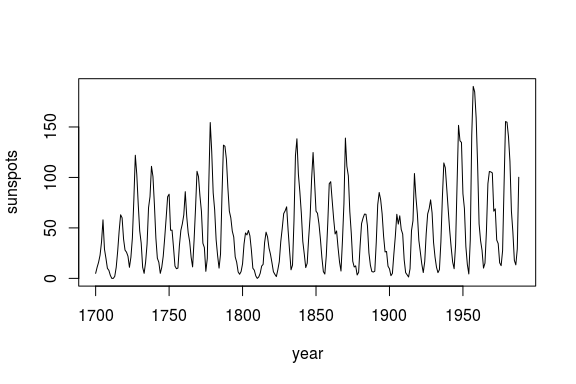
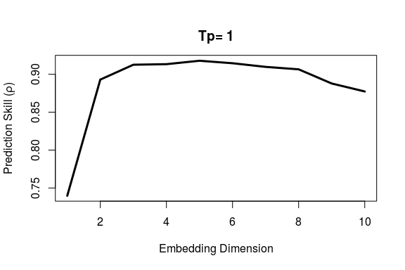
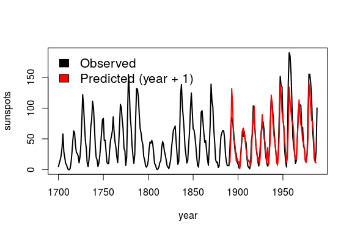

rEDM
====

Overview
--------

The `rEDM` package is a collection of methods for Empirical Dynamic
Modeling (EDM). EDM is based on the mathematical theory of
reconstructing attractor manifolds from time series data, with
applications to forecasting, causal inference, and more. It is based on
research software developed for the [Sugihara Lab](http://deepeco.ucsd.edu/)
(University of California San Diego, Scripps Institution of Oceanography).

## Empirical Dynamic Modeling (EDM)
-------------------------------------

This package implements an R wrapper of
[EDM](http://deepeco.ucsd.edu/nonlinear-dynamics-research/edm/) tools from
the [cppEDM](https://github.com/SugiharaLab/cppEDM) library.
Introduction and documentation are are avilable
[online](https://sugiharalab.github.io/EDM_Documentation/ "EDM Docs"), or
in the package [API docs](https://github.com/SugiharaLab/rEDM/blob/master/inst/doc/rEDM.pdf "rEDM API").  

Functionality includes:

* Simplex projection (Sugihara and May 1990)
* Sequential Locally Weighted Global Linear Maps (S-map) (Sugihara 1994)
* Multivariate embeddings (Dixon et. al. 1999)
* Convergent cross mapping (Sugihara et. al. 2012)
* Multiview embedding (Ye and Sugihara 2016)

Installation
------------

You can install rEDM from CRAN with:

    install.packages("rEDM")

or the development version from github with:

    install.packages("devtools")
    devtools::install_github("SugiharaLab/rEDM")

Example
-------

We begin by looking at annual time series of sunspots:

    df <- data.frame(yr = as.numeric(time(sunspot.year)), 
                     sunspot_count = as.numeric(sunspot.year))

    plot(df$yr, df$sunspot_count, type = "l", 
         xlab = "year", ylab = "sunspots")

First, we use `EmbedDimension()` to determine the optimal embedding
dimension, E:

    library(rEDM)   # load the package
    # If you're new to the rEDM package, please check out the tutorial:
    # vignette("rEDM-tutorial")

    E.opt = EmbedDimension( dataFrame = df,    # input data
                            lib     = "1 280", # portion of data to train
                            pred    = "1 280", # portion of data to predict
                            columns = "sunspot_count",
                            target  = "sunspot_count" )

    E.opt
    #     E    rho
    # 1   1 0.7397
    # 2   2 0.8930
    # 3   3 0.9126
    # 4   4 0.9133
    # 5   5 0.9179
    # 6   6 0.9146
    # 7   7 0.9098
    # 8   8 0.9065
    # 9   9 0.8878
    # 10 10 0.8773

Highest predictive skill is found between `E = 3` and `E = 6`. Since we
generally want a simpler model, if possible, we use `E = 3` to forecast
the last 1/3 of data based on training (attractor reconstruction) from
the first 2/3.

    simplex <- Simplex( dataFrame = df, 
                        lib     = "1   190", # portion of data to train
                        pred    = "191 287", # portion of data to predict
                        columns = "sunspot_count",
                        target  = "sunspot_count",
                        E       = 3 )

    plot( df$yr, df$sunspot_count, type = "l", lwd = 2,
          xlab = "year", ylab = "sunspots")
    lines( simplex$yr, simplex$Predictions, col = "red", lwd = 2)
    legend( 'topleft', legend = c( "Observed", "Predicted (year + 1)" ),
            fill = c( 'black', 'red' ), bty = 'n', cex = 1.3 )

Further Examples
----------------

Please see the package vignettes for more details:

    browseVignettes("rEDM")

### References

Sugihara G. and May R. 1990. Nonlinear forecasting as a way of
distinguishing chaos from measurement error in time series. Nature,
344:734–741.

Sugihara G. 1994. Nonlinear forecasting for the classification of
natural time series. Philosophical Transactions: Physical Sciences and
Engineering, 348 (1688) : 477–495.

Dixon, P. A., M. Milicich, and G. Sugihara, 1999. Episodic fluctuations
in larval supply. Science 283:1528–1530.

Sugihara G., May R., Ye H., Hsieh C., Deyle E., Fogarty M., Munch S.,
2012. Detecting Causality in Complex Ecosystems. Science 338:496-500.

Ye H., and G. Sugihara, 2016. Information leverage in interconnected 
ecosystems: Overcoming the curse of dimensionality. Science 353:922–925.

