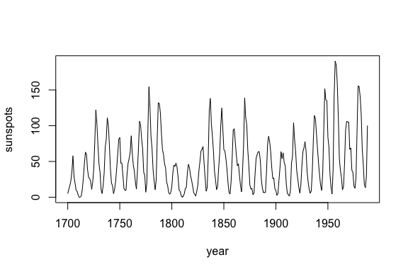
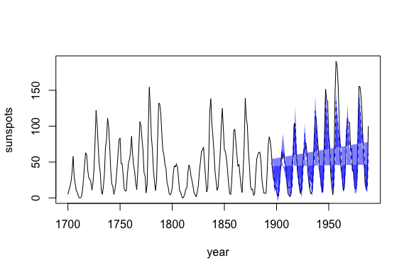

<!-- README.md is generated from README.Rmd. Please edit that file -->

# rEDM

[](https://travis-ci.org/ha0ye/rEDM)
[](https://doi.org/10.5281/zenodo.596502)
[](https://cran.rstudio.com/web/packages/rEDM/index.html)

## Overview

The `rEDM` package is a collection of methods for Empirical Dynamic
Modeling (EDM). EDM is based on the mathematical theory of recontructing
attractor manifolds from time series data, with applications to
forecasting, causal inference, and more. It is based on research
software previously developed for the Sugihara Lab (University of
California San Diego, Scripps Institution of Oceanography).

## Installation

You can install rEDM from CRAN with:

``` r
install.packages("rEDM")
```

OR from github with:

``` r
# install.packages("devtools")
devtools::install_github("ha0ye/rEDM")
```

## Example

We begin by looking at annual time series of sunspots:

``` r
dat <- data.frame(yr = as.numeric(time(sunspot.year)), 
                  sunspot_count = as.numeric(sunspot.year))

plot(dat$yr, dat$sunspot_count, type = "l", 
     xlab = "year", ylab = "sunspots")
```

<!-- -->

First, we use simplex to determine the optimal embedding dimension, E:

``` r
library(rEDM)                             # load the package

n <- NROW(dat)
lib <- c(1, floor(2/3 * n))               # indices for the first 2/3 of the time series
pred <- c(floor(2/3 * n) + 1, n)          # indices for the final 1/3 of the time series

output <- simplex(dat,                    # input data (for data.frames, uses 2nd column)
                  lib = lib, pred = lib,  # which portions of the data to train and predict
                  E = 1:10)               # embedding dimensions to try

summary(output[, 1:9])
#>        E              tau          tp          nn           num_pred    
#>  Min.   : 1.00   Min.   :1   Min.   :1   Min.   : 2.00   Min.   :182.0  
#>  1st Qu.: 3.25   1st Qu.:1   1st Qu.:1   1st Qu.: 4.25   1st Qu.:184.2  
#>  Median : 5.50   Median :1   Median :1   Median : 6.50   Median :186.5  
#>  Mean   : 5.50   Mean   :1   Mean   :1   Mean   : 6.50   Mean   :186.5  
#>  3rd Qu.: 7.75   3rd Qu.:1   3rd Qu.:1   3rd Qu.: 8.75   3rd Qu.:188.8  
#>  Max.   :10.00   Max.   :1   Max.   :1   Max.   :11.00   Max.   :191.0  
#>       rho              mae             rmse            perc  
#>  Min.   :0.6991   Min.   :10.17   Min.   :13.94   Min.   :1  
#>  1st Qu.:0.8759   1st Qu.:10.78   1st Qu.:14.21   1st Qu.:1  
#>  Median :0.9079   Median :11.32   Median :14.86   Median :1  
#>  Mean   :0.8806   Mean   :12.23   Mean   :16.51   Mean   :1  
#>  3rd Qu.:0.9172   3rd Qu.:12.72   3rd Qu.:17.42   3rd Qu.:1  
#>  Max.   :0.9195   Max.   :19.03   Max.   :26.31   Max.   :1
```

It looks like `E = 3` or `4` is optimal. Since we generally want a
simpler model, if possible, let’s go with `E = 3` to forecast the
remaining 1/3 of the data.

``` r
output <- simplex(dat,
                  lib = lib, pred = pred, # predict on last 1/3
                  E = 3, 
                  stats_only = FALSE)     # return predictions, too

predictions <- na.omit(output$model_output[[1]])

plot(dat$yr, dat$sunspot_count, type = "l", 
          xlab = "year", ylab = "sunspots")
lines(predictions$time, predictions$pred, col = "blue", lty = 2)
polygon(c(predictions$time, rev(predictions$time)), 
        c(predictions$pred - sqrt(predictions$pred_var), 
        rev(predictions$pred + sqrt(predictions$pred_var))), 
        col = rgb(0, 0, 1, 0.5), border = NA)
```

<!-- -->

## Further Examples

Please see the package vignettes for more details:

``` r
browseVignettes("rEDM")
```
