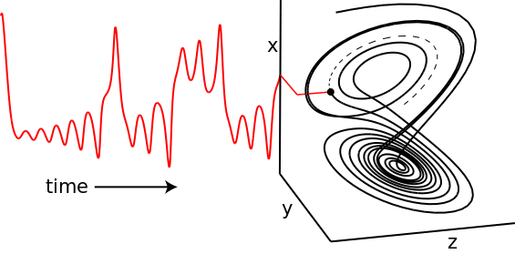
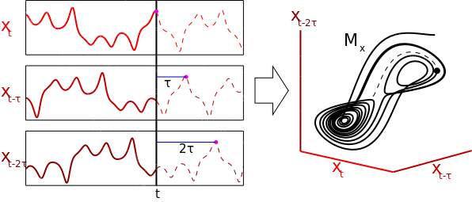
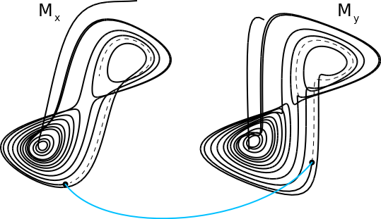

```{r setup, include = FALSE}
knitr::opts_chunk$set(echo = TRUE, warning = FALSE, tidy = TRUE,
                      fig.pos = 'h', fig.align = 'center',
                      fig.width = 4, fig.height = 3.3)
knitr::opts_knit$set(global.par = TRUE, progress = FALSE)
options(digits = 2)
par.orig = par()
par(mar = c(4, 4, 2, 1), mgp = c(2.5, 1, 0))
```

<!------------------------------------------------------------------------->
# Abstract
<!------------------------------------------------------------------------->

Empirical dynamic modeling (EDM) is an emerging non-parametric framework for modeling nonlinear dynamic systems. EDM is based on the mathematical theory of reconstructing attractor manifolds from time series data [@Takens_1981]. The **rEDM** package collects several EDM methods, including simplex projection [@Sugihara_1990], S-map [@Sugihara_1994], multivariate embeddings [@Dixon_1999], convergent cross mapping [@Sugihara_2012], and multiview embedding [@Ye_2016]. Here, we introduce the basic underlying theory, and describe the functionality of **rEDM** using examples from both model simulations and real data.

<!------------------------------------------------------------------------->
# Installation
<!------------------------------------------------------------------------->

The **rEDM** package can be obtained in two main ways. The standard version of the package can be obtained through CRAN (the Comprehensive R Archive Network): https://cran.r-project.org/package=rEDM:

```{r CRAN installation instructions, eval = FALSE}
install.packages("rEDM")
```

The development version is available on GitHub at [SugiharaLab](github.com/SugiharaLab/rEDM), and can be installed using R **devtools**.

```{r GitHub installation instructions, eval = FALSE}
devtools::install_github("SugiharaLab/rEDM")
```

<!------------------------------------------------------------------------->
# Introduction
<!------------------------------------------------------------------------->

Many scientific fields use models as approximations of reality and for various purposes, for example, testing hypotheses regarding mechanisms or processes, explaining past observations, and predicting future outcomes. In many cases these models are based on hypothesized parametric equations; however, explicit equations can be impractical when the underlying mechanisms are unknown or are too complex to be characterized with existing datasets. Empirical models, which infer patterns and associations from the data (instead of using hypothesized equations), represent an alternative and highly flexible approach. Here, we review the theoretical background for empirical dynamic modeling (EDM) and the functionality of the **rEDM** package, which are intended for nonlinear dynamic systems that can prove problematic for traditional modeling approaches.

The basic goal underlying EDM is to reconstruct the behavior of dynamic systems using time series data. This approach is based on mathematical theory developed initially by [@Takens_1981], and expanded by others [@Sauer_1991; @Casdagli_1991; @Deyle_2011]. Because these methods operate with minimal assumptions, they are particularly suitable for studying systems that exhibit non-equilibrium dynamics and nonlinear state-dependent behavior (i.e. where interactions change over time and as a function of the system state).

<!------------------------------------------------------------------------->
# Empirical Dynamic Modeling
<!------------------------------------------------------------------------->

<!------------------------------------------------------------------------->
## Time Series as Observations of a Dynamic System
<!------------------------------------------------------------------------->

The essential concept is that time series can be viewed as projections of the behavior of a dynamic system. First, the system state can be described as a point in a high-dimensional space. The axes of this space can be thought of as fundamental state variables; in an ecosystem, these variables might correspond to population abundances, resources, or environmental conditions. Second, the system state changes through time following a set of deterministic rules. In other words, the behavior of the system is not completely stochastic.

Consequently, it is possible to project the system state onto one of the coordinate axes and obtain the value of the corresponding state variable. Sequential projections over time will thus produce a time series for that variable. For example, in figure 1 the states of the canonical Lorenz Attractor [@Lorenz_1963] are projected onto the $x$-axis, creating a time series of variable $x$.

<!------------
   Figure 1 
------------->
```{r, LorenzProjection, echo = FALSE, fig.cap = "Time Series Projection from the Lorenz Attractor.", out.width = 250, fig.align = 'center'}

```

Although different time series observed from a system can represent independent state variables, in general, each time series is an *observation function* of the system state that may convolve several different state variables.

<!------------------------------------------------------------------------->
## Attractor Reconstruction / Takens' Theorem
<!------------------------------------------------------------------------->

The goal of EDM is to reconstruct the system dynamics from time series data. As seen above, a time series can be thought of as sequential projections of the motion on an attractor; in other words, information about the behavior is encoded in the temporal ordering of the time series. Takens' Theorem [@Takens_1981] states that mathematically valid and property preserving reconstructions of the attractor can be created using lags of a single time series, then substituting those lagged time series for unknown or unobserved variables. In other words, instead of representing the system state using a complete set of state variables, we can instead use an `E`-dimensional lagged-coordinate embedding:

$$ \vec{x}_t = \langle x_t, x_{t-\tau}, \dots, x_{t-(E-1)\tau} \rangle $$

<!------------
   Figure 2
------------->
```{r fig_attractor_reconstruction, echo = FALSE, fig.cap = "Attractor Reconstruction from 3 Lagged Coordinates", out.width = 250, fig.align = 'center'}

```

If sufficient lags are used, the reconstruction preserves essential mathematical properties of the original system: reconstructed states will map one-to-one to actual system states, and nearby points in the reconstruction will correspond to similar system states. Figure 2 shows a reconstruction of the Lorenz attractor where the reconstructed system state is comprised of 3 lags of variable $x$. Here, the visual similarity between the reconstruction and the original Lorenz Attractor is quite clear.

As a consequence of the fact that dynamical properties of the original system can be recovered from a single time series, there are multiple applications. For example, empirical models can be used for forecasting [@Sugihara_1990], to understand nonlinear behavior [@Sugihara_1994], or to uncover mechanism [@Dixon_1999]. Moreover, recent work describes how EDM can be used to identify causal interactions, by testing whether two time series are observed from the same system [@Sugihara_2012]. In the next section, we demonstrate how **rEDM** can be used to accomplish these various tasks.


<!------------------------------------------------------------------------->
# Demonstration of EDM
<!------------------------------------------------------------------------->

<!------------------------------------------------------------------------->
## Nearest Neighbor Forecasting using Simplex Projection
<!------------------------------------------------------------------------->

As mentioned previously, the reconstruction will map one-to-one to the original attractor manifold if enough lags are used (i.e. if the reconstruction has a sufficiently large embedding dimension). If the embedding dimension is too small, then reconstructed states can overlap and appear to be the same even though they actually correspond to different states. These "singularities" will result in poor forecast performance because the system behavior cannot be uniquely determined in the reconstruction. As a consequence, we can use prediction skill as an indicator for identifying the optimal embedding dimension. In the following example we demonstrate the `Simplex()` projection nearest neighbor forecasting method [@Sugihara_1990], and its' extension `EmbedDimension()` that automates evaluation of an optimal embedding dimension.

<!------------------------------------------------------------------------->
### Example
<!------------------------------------------------------------------------->

In this example, time series come from a simulation of the tent map that exhibits chaotic behavior. The tent map is a discrete-time dynamic system, where a sequence, $x_t$, on the interval $[0, 1]$ is iterated according to:

\begin{equation*}
  x_{t+1} = \begin{cases}
            2x_t     & x_t <   \frac{1}{2}\\
            2(1-x_t) & x_t \ge \frac{1}{2}
            \end{cases}
\end{equation*}

In **rEDM**, a sample time series of first-differenced values can be found in dataset `TentMap`.

We begin by loading the **rEDM** package and examining the `TentMap` data:
```{r load package}
library(rEDM)
str(TentMap)
```

We can see that the data consists of a data.frame with two columns: `Time` and `TentMap`. All rEDM input data files or data.frames are assumed to have a time vector in the first column.  Data files are expected to be in .csv format with the first line a header of column names, data.frames are also expected to have column names.

The `Simplex` function has 5 required parameters:

  |          |              |
--|----------|--------------|----------------------------------------
1.| `columns`|  `TentMap`   | name of column(s) of embedding library
2.| `target` |  `TentMap`   | name of column for prediction
3.| `lib`    |  `"1 100"`   | start stop indices of embedding library
4.| `pred`   |  `"201 500"` | start stop indices of predictions
5.| `E`      |  `3`         | embedding dimension

`columns` specifies the timeseries vector(s) that form the library, `target` is the column on which predictions will be made. `lib` defines row indices of the "training" portion of data, `pred` corresponds to row indices of the "test" portion, and `E` defines the embedding dimension.

*Note that if any overlap in the lib and pred is found, it will enable leave-one-out cross-validation. If `verbose = TRUE`, a warning message will be raised.*

In this univariate case, we specify the "TentMap" column of the data frame for both `columns` and `target`, and select the first 100 points (indices 1 to 100) in the time series to constitute the "library set", and a separate 300 point span (indices 201 to 500) as the "prediction set".  

Default parameters of `knn` (k-nearest neighbors) and `Tp` (time-to-prediction) are assumed. The default `knn = 0` sets the number of nearest neighbors to `E + 1`, and default `Tp` is 1 timestep (observation row).  With these parameters we demonstrate the `Simplex()` function:

```{r simplex on tentmap}
simplex_out <- Simplex( dataFrame = TentMap, lib = "1 100", pred = "201 500",
columns = 'TentMap', target = 'TentMap', E = 3 )
simplex_out[ c(1:2, 300:301), ]
```

Note that the returned data.frame has 1 `NaN` as the first `Predictions` point since `Tp = 1`, and, the last `Observations` will likewise be `NaN` with the time vector adjusted to accommodate `Tp` rows beyond the data as needed.

Computation of Pearson correlation, MAE and RMSE errors between the forecast `Observations` and `Predictions` can be performed with the `ComputeError()` function.

```{r tentmap simplex stats}
ComputeError( simplex_out $ Observations, simplex_out $ Predictions )
```

<!------------------------------------------------------------------------->
## Optimal embedding dimension
<!------------------------------------------------------------------------->

As noted earlier, identification of the optimal embedding dimension to best "unfold" the dynamics can be assessed with simplex prediction skill. **rEDM** provides the `EmbedDimension()` function to automate this task. `EmbedDimension()` parallelises function calls to `Simplex()`, which automatically sets values of `E` from 1 to `maxE`=10.  Continuing with the previous example, we invoke `EmbedDimension()`:

```{r Embed_Dim_TentMap, fig.cap="TentMap data prediction skill vs. embedding dimension." }
rho_E <- EmbedDimension( dataFrame = TentMap, lib = "1 100", pred = "201 500",
columns = 'TentMap', target = 'TentMap' )
```

The output is a data.frame with columns `E` and `rho` detailing the embedding dimension and Pearson correlation coefficient between the simplex projected forecast at `Tp = 1` timesteps ahead, and the observed data over the `pred` indices. Here, we observe that forecast skill peaks at `E = 2`, indicating that the dynamics of our data are unfolded best in 2 dimensions. *Note that this optimal value does not have to correspond to the dimensionality of the original system.*  The forecast skill will be affected by factors such as observational noise, process error, and time series length, and so it is more useful to think of the embedding dimension as a practical measure that is dependent on properties of the data.

<!------------------------------------------------------------------------->
## Prediction Decay
<!------------------------------------------------------------------------->

An important property of many natural systems is that nearby trajectories eventually diverge over time (i.e. "deterministic chaos" -- the "butterfly effect"). In essence, this means that while short-term prediction is often possible, information about the predictive state of the system is diluted over time, hindering long-term forecasting. We can demonstrate this effect by examining how prediction skill changes as we increase the `Tp` argument, the "time to prediction", defining the number of time steps into the future at which forecasts are made.  **rEDM** provides the `PredictInterval()` function to automate this task.

<!------------------------------------------------------------------------->
### Example
<!------------------------------------------------------------------------->

Using the same data with the `PredictInterval()` function, we supply the embedding dimension parameter with the value determined previously (`E = 2`):

```{r Prediction_interval_on_TentMap, fig.cap = "Tent map first differences simplex prediction skill as a function of forecast interval." }
rho_Tp <- PredictInterval( dataFrame = TentMap, lib = "1 100",
pred = "201 500", target = 'TentMap', columns = 'TentMap', E = 2 )
```

As above, the returned object is a data.frame with forecast skill `rho` and time to prediction `Tp`.  As expected (because the parameters chosen for the tent map fall in the region for chaotic behavior), the decline in forecast skill (`rho` $\rightarrow 0$) as the forecast interval `Tp` increases, indicates that the system may be chaotic.


<!------------------------------------------------------------------------->
## Identifying Nonlinearity
<!------------------------------------------------------------------------->

One concern is that time series may show predictability even if they are purely stochastic, they behave similarly to autocorrelated red noise. Fortunately, we can distinguish between red noise and nonlinear deterministic behavior by using S-maps as described in [@Sugihara_1994].

In contrast to the nearest-neighbor interpolation of simplex projection, the S-map forecasting method [@Sugihara_1994] fits local linear maps to describe the dynamics. In addition to the standard set of parameters for a lagged-coordinate reconstruction as in simplex, S-maps contain a nonlinear localisation parameter, $\theta$, that determines the degree to which points are weighted when fitting the local linear map. For example, when $\theta = 0$, all points are equally weighted, such that the local linear map is identical for different points in the reconstructed state-space. As such, the S-map will be identical to a global linear map (i.e. an autoregressive model). When values of $\theta$ are greater than $0$, nearby points in the state space receive larger weight, and the local linear map can vary in state-space to accommodate nonlinear behavior. 

Consequently, if the time series are sampled from autoregressive red noise, then the linear model ($\theta = 0$) should produce better forecasts, because the global linear map (which will, in effect, be fitted to more data points) will reduce the effects of observation error compared to local linear maps. In contrast, if forecast skill increases for $\theta > 0$, then the results are suggestive of nonlinear dynamics wherein better forecasts are achieved when the local linear map can change depending on the location in state-space: it is a better description of state-dependent behavior.

<!------------------------------------------------------------------------->
### Example
<!------------------------------------------------------------------------->

The `PredictNonlinear()` function provides an evaluation of S-map forecast skill as a function of the localisation parameter `theta`.  If unspecified, `theta` values will range from 0.01 to 9.

Typically, when using `S-map` to test for nonlinear behavior, we want to use all available points in the reconstruction of the local linear map, not just `knn` nearest neighbors as in simplex projection.  With all points available, S-map uses the `theta` parameter to control the weighting assigned to individual points, thereby localising the dynamics to capture nonlinear behavior.  When `knn = 0`, the default, `SMap()` will use all available points.

Here we use an embedding dimension of `E = 2` and the same parameters as in the previous examples, however, we specify the "TentMapNoise" data that adds Gaussian noise to the TentMap data as one would normally encounter with noisy observational data.

```{r Predict_nonlinear_on_TentMap, fig.cap = "Tent map first differences S-map prediction skill as a function of S-map localisation parameter."}
rho_theta <- PredictNonlinear( dataFrame = TentMapNoise, lib = "1 100",
pred = "201 500", target = 'TentMap', columns = 'TentMap', E = 2 )
```

The result is a data.frame with columns `Theta` and `rho`. Here, we see that forecast skill substantially improves as `theta` increases, indicating the presence of nonlinear dynamics. We also observe a degradation in forecast skill at high values of `theta` as the local linear map overfits to insufficient nearest neighbors.

<!------------------------------------------------------------------------->
## `Simplex()` and `SMap()` functions
<!------------------------------------------------------------------------->

The functions `EmbedDimension()`, `PredictInterval()` and `PredictNonlinear()` are multithreaded wrapper functions for the `Simplex()` and `SMap()` algorithms. `EmbedDimension()` and `PredictInterval()` parallelise calls to `Simplex()` to evaluate forecast skill as a function of embedding dimension and prediction interval respectively.  `PredictNonlinear()` parallelises calls to `SMap()` to assess predictive skill as a function of the nearest neighbor localisation parameter. However, one can equivalently call the underlying `Simplex()` and `SMap()` functions directly.

<!------------------------------------------------------------------------->
### `Simplex()`
<!------------------------------------------------------------------------->

For example, evaluation of the simplex prediction at an optimal embedding dimension of `E = 2` can be performed as:

```{r Simplex_TentMap }
tentMapPredict <- Simplex( dataFrame = TentMap, lib = "1 100",
pred = "201 500", target = 'TentMap', columns = 'TentMap', E = 2 )

ComputeError( tentMapPredict $ Observations, tentMapPredict $ Predictions ) $ rho
```

<!------------------------------------------------------------------------->
### `SMap()`
<!------------------------------------------------------------------------->

An individual S-map evaluation corresponding to the optimal `PredictNonlinear()` result from above is:

```{r Tentmap_Noise_S-map } 
smap = SMap( dataFrame = TentMapNoise, lib = "1 100", pred = "201 500",
target = 'TentMap', columns = 'TentMap', E = 2, theta = 3 )
```

`SMap()` returns a named list with `predictions` and  `coefficients` data.frames, with `NaN` inserted appropriately where no predictions or observations are available. 

```{r S-map_tentMap_results}
head( cbind( smap $ predictions, smap $ coefficients ), 2 )
tail( cbind( smap $ predictions, smap $ coefficients ), 2 )
```

<!------------------------------------------------------------------------->
## Generalized Takens Theorem
<!------------------------------------------------------------------------->

A practical reality is that sampled observations of complex dynamics are usually composed of finite, noisy data.  Additionally, the presence of stochastic, non-deterministic drivers means that "multivariate" reconstructions can often be a better description than "univariate" reconstructions.  This means that in addition to creating an attractor from lags of one time series, it can be advantageous to combine different time series to create the phase-space embedding, provided they are all observed from the same system [@Sauer_1991; @Deyle_2011]. 

In **rEDM**, the `Simplex()` and `SMap()` functions allow multivariate reconstructions from any set of observation vectors. A multivariate reconstruction is defined by specifying which columns to use as coordinates in the `columns` argument, and which column is to be forecast in the `target` argument.  By default, **rEDM** will create Takens time-delay embeddings from univariate or multivariate data, however, this can be prevented by setting the `embedded` parameter `TRUE`. In this case, the input data are assumed to already constitute a valid multidimensional embedding, and no time-delay embedding is performed. 

<!------------------------------------------------------------------------->
### Example
<!------------------------------------------------------------------------->

We begin by examining an example dataset from a coupled 3-species model system.

```{r block_3sp_data}
head( block_3sp, 3 )
```

Here, `block_3sp` is a 10-column data.frame with 9 data columns. This data has already been time-delay embedded to dimension `E = 3` with a time delay of `tau = -1`. We use simplex forecasting based on a multivariate embedding of the three data vectors `x_t x_t-1 z_t` with `embedded = TRUE` and `E = 3`:

```{r 3_Species_simplex, fig.cap="Simplex Tp=1 forecast of $x_t$."}
smplx_3species = Simplex( dataFrame = block_3sp, lib = "1 100",
pred = "101 190", E = 3, columns = "x_t x_t-1 z_t", target = "x_t",
embedded = TRUE )
```

A plot of the predictions vs. observations can be examined with:

```{r plot_3_species, fig.cap="Scatter plot of simplex forecast of $x_t$ vs. observations."}
err = ComputeError( smplx_3species $ Observations,
                    smplx_3species $ Predictions )
plot( smplx_3species $ Observations, smplx_3species $ Predictions,
pch = 19, cex = 0.5, xlab = 'Observations', ylab = 'Predictions',
main = '3 Species x_t' )
abline( a = 0, b = 1, lty = 2, col = 'blue' )
text( -1, 1, paste( capture.output( cbind( err ) ), collapse = '\n' ) )
```

<!------------------------------------------------------------------------->
## S-map Coefficients
<!------------------------------------------------------------------------->

As described in [@Deyle_2016], S-map coefficients from the appropriate multivariate embedding can be interpreted as dynamic, time-varying interaction strengths. We demonstrate this with a chaotic timeseries described in [@Lorenz_1996], defined for N variables k=1, ... N, as 

\begin{equation*}
  \frac{ dx_{k} }{ dt } = -X_{k-2} X_{k-1} + X_{k-1} X_{k+1} - X_k + F
\end{equation*}

The `Lorenz5D` data.frame contains a N=5 dimensional system with F=8 from [@Lorenz_1996].  Here, we use `SMap()` to compute a 4-dimensional forecast at `Tp`=1:

```{r S-map_Lorenz96 }
smap_Lorenz <- SMap( dataFrame = Lorenz5D, lib = "1 500", pred = "601 900",
E = 4, theta = 3, columns = "V1 V2 V3 V4", target = "V1", embedded = TRUE )
```

As noted earlier, `SMap()` returns a named list with two data frames, `predictions` and `coefficients`:

```{r set precision, echo = FALSE}
options(digits=4)
```

```{r S-map_Lorenz_results, warning = FALSE}
head( cbind( smap_Lorenz $ predictions, smap_Lorenz $ coefficients[,2:6] ), 3 )
```

Here, we plot the time series for the observed (blue) and predicted (red) values of `V1` in the top panel; and the inferred interactions (S-map coefficients) for the influence of `V4`, `V3` and `V2` on future values of `V1` in the lower panels.

```{r, echo = FALSE}
par(mfrow = c(4, 1), mar = c(2, 4, 0.5, 1), oma = c(0, 0, 0, 0),
    mgp = c(2.1, 1, 0) )
```

```{r smap_Lorenz_plot, out.width = 300, fig.cap = "S-map prediction and coefficients of Lorenz'96 5-D system."}
predictions = smap_Lorenz $ predictions
coefficients = smap_Lorenz $ coefficients
Time = predictions $ Time

plot( Time, predictions $ Observations, type = "l", col = "blue",
ylab = "V1", xlab = "", lwd = 2, cex.lab = 1.3, cex.axis = 1.3 )
lines( Time, predictions $ Predictions, lwd = 2, col = 'red' )
legend("topright", legend = c("observed", "predicted"),
fill = c( 'blue', 'red' ), bty = "n", cex = 1.3 )

plot( Time, coefficients $ C4, type = "l", col = "brown",
ylab = "dV4/dV1", xlab = "", lwd = 2, cex.lab = 1.3, cex.axis = 1.3 )
plot( Time, coefficients $ C3, type = "l", col = "darkgreen",
ylab = "dV3/dV1", xlab = "", lwd = 2, cex.lab = 1.3, cex.axis = 1.3 )
plot( Time, coefficients $ C2, type = "l", col = "blue",
ylab = "dV2/dV1", xlab = "", lwd = 2, cex.lab = 1.3, cex.axis = 1.3 )
```

```{r, echo = FALSE}
par(mfrow = c(1, 1), mar = c(4, 4, 2, 1), mgp = c(2.5, 1, 0))
```

\newpage
<!------------------------------------------------------------------------->
## Multiview Embedding
<!------------------------------------------------------------------------->

The generality of Takens Theorem means that in situations with multivariate time series, there can often be many different, valid attractor reconstructions. As described in [@Ye_2016], combining these different models can result in improved forecasts.

Here, we demonstrate this idea using the `Multiview()` function with the 3-species data used above. `Multiview()` operates by constructing all possible embeddings of dimension `E` with lag up to `E-1`.  These embeddings are ranked by forecast skill (`rho`) over the `lib` portion of the data.  The individual forecasts for the top `multiview` embeddings are then averaged together.  If `multiview` is not specified it is set to sqrt(C) where C is the number of E-dimensional combinations created from all data vectors.

```{r multiview}
Mview = Multiview( dataFrame = block_3sp, lib = "1 100", pred = "101 190", E = 3, columns = "x_t y_t z_t", target = "x_t" )
```

`Multiview()` returns a named list with two data.frames: `View`, and `Predictions`.  `View` lists the various combinations of data embedding vectors used for the forecasts along with their prediction statistics.  `Predictions` returns the final averaged multiview projections.

```{r multiview results}
Mview $ View[ which( Mview $ View $ rho > 0.91 ),  ]
```

\newpage
<!------------------------------------------------------------------------->
## Causality Inference and Cross Mapping
<!------------------------------------------------------------------------->

One of the corollaries to the Generalized Takens Theorem is that it should be possible to cross predict or cross map between variables that are observed from the same system. Consider two variables, $x$ and $y$ that interact in a dynamic system. Then the univariate reconstructions based on $x$ or $y$ alone should uniquely identify the system state and and thus the corresponding value of the other variable.

<!------------
   Figure 10
------------->
```{r fig_cross_map, echo = FALSE, fig.cap = "Cross Mapping Between Reconstructions of the Lorenz Attractor"}

```
In the case of unidirectional causality, e.g. $x$ causes $y$, the causal variable ($x$) leaves a signature on the affected variable ($y$). Consequently, the reconstructed states based on $y$ can be used to cross predict the values of $x$ (because the reconstruction based on $y$ must be complete, it must include information about the value of $x$). Note that this cross prediction is in the *opposite* direction of the causal effect. At the same time, cross prediction from $x$ to $y$ will fail, because the time series of $x$ behaves independently of $y$, so a univariate reconstruction using only lags of $x$ is necessarily incomplete.

Although $x$ has incomplete information for predicting $y$, it does affect the values of $y$, and therefore will likely to have nonzero predictive skill. However, this cross mapping will be limited to the statistical association between $x$ and $y$ and will generally not improve as longer time series are used for reconstruction. In contrast, the cross prediction of $x$ from $y$ will generally improve. This convergence is therefore a crucial property for inferring causality. For practical reasons, the sensitivity of detecting causality this way is improved if, instead of predicting the future value of another variable, we estimate the concurrent value of another variable. We refer to this modified method as cross mapping, because we are not "predicting" the future.

For a more detailed description of using cross mapping to infer causation, see [@Sugihara_2012].

<!------------------------------------------------------------------------->
## Convergent Cross Mapping (CCM)
<!------------------------------------------------------------------------->

In **rEDM**, convergent cross mapping is implemented as the `CCM()` function, which provides a wrapper to compute cross map skill for different subsamples of the data. In the following example, we reproduce the analysis from [@Sugihara_2012] to identify causality between anchovy landings in California and Newport Pier sea-surface temperature. For this example, a previously identified value of `3` for the embedding dimension will be used.

To quantify convergence, we compute the cross map skill over many random subsamples of the time series. The `libSizes` argument specifies the size of the library set, and `sample` specifies the number of subsamples generated at each library size. `random` and `replacement` specify how the subsamples will be generated.  The default is random sampling without replacement.

```{r sardine_anchovy_ccm, fig.cap = "Convergent cross mapping of Newport sea surface temperature with anchovy landings."}
cmap <- CCM( dataFrame = sardine_anchovy_sst, E = 3, Tp = 0, columns = "anchovy", target = "np_sst", libSizes = "10 70 5", sample = 100, showPlot = TRUE )
```

The output is a data.frame with statistics for each model run (in this case, 100 models at each library size) as a function of library size.  Recalling that cross mapping indicates causal influence in the reverse direction (target to source), we see that the cross mapping `anchovy:np_sst` converges at a positive value of $\rho$, indicating that Newport sea surface temperature influences anchovy landings.  Because average cross map skill less than 0 means there is no prediction skill, (predictions should not be anticorrelated with observations), we infer from the `np_sst:anchovy` cross mapping that anchovy landings do not effect sea surface temperatures. 


<!------------------------------------------------------------------------->
# Real Data Example
<!------------------------------------------------------------------------->

<!------------------------------------------------------------------------->
## Apple-Blossom Thrips
<!------------------------------------------------------------------------->

In this example, we use EDM to re-examine the classic apple-blossom thrips (*Thrips imaginis*) time series from the Wait Institute in Australia [@Davidson_1948; @Davidson_1948a]. Seasonal outbreaks of *Thrips imaginis* were observed to vary greatly in magnitude from year to year, but large outbreaks tended to coincide across large spatial domains. This lead to the hypothesis that regional-scale climatic factors were responsible for controlling the size of the seasonal outbreaks (what might now be called the Moran effect [@Moran_1953]).

```{r Thrips data}
head(Thrips, 2)
```

The data column `Thrips_imaginis` contains counts of *Thrips imaginis* obtained from the Global Population Dynamics Database (GPDD) [@NERC-Centre-for-Population-Biology_2010]. `maxT_degC` is the mean maximum daily temperature ($^\circ$C) taken over each month and `Rain_mm` is the monthly rainfall (mm), both from the Waite Institute. The final column `Season` is a simple annual sinusoid that peaks in December (the Austral summer) to emulate an indicator of season.

First, we plot the data. Note that all the time-series variables, particularly the mean maximum daily temperature, show marked seasonality.

```{r thrips plot, echo = FALSE, fig.width = 3, fig.height = 3.5, fig.cap = "Thrips abundance and environmental variables."}
par(mfrow = c(4, 1), mar = c(2, 4, 0, 1), mgp = c(2., 0.5, 0))
time_dec <- Thrips $ Year + (Thrips $ Month)/12
plot(time_dec, Thrips $ Thrips_imaginis, type = "l", lwd = 2, col = "darkgreen", ylab = "Thrips", xlab = "")
plot(time_dec, Thrips $ maxT_degC, type = "l", lwd = 2, col = "red", ylab = "maxT (C)", xlab = "")
plot(time_dec, Thrips $ Rain_mm, type = "l", lwd = 2, col = "blue", ylab = "Rain (mm)", xlab = "")
plot(time_dec, Thrips $ Season, type = "l", lwd = 2, col = "magenta", ylab = "Season", xlab = "" )
mtext("Year", side = 1, outer = TRUE, line = 1)
```

```{r, echo = FALSE }
par(mfrow = c(1, 1), mar = c(4, 4, 2, 1), mgp = c(2.5, 1, 0))
```

<!------------------------------------------------------------------------->
### Univariate Analysis
<!------------------------------------------------------------------------->

We first examine the dependence of simplex predictability on the embedding dimension.

```{r univariate thrips, fig.cap = "Simplex embedding dimension for Thrips abundance.", fig.width = 4, fig.height = 3. }
rho_E <- EmbedDimension( dataFrame = Thrips, columns = "Thrips_imaginis", target = "Thrips_imaginis", lib = "1 72", pred = "1 72", showPlot = TRUE )
```

While there is an initial peak in the simplex prediction at `E = 3`, the global maximum is at `E = 8`. This suggests that both `E = 3` and `E = 8` are practical embedding dimensions, although `E = 8` is preferrable with a higher predictive skill. 

To test for nonlinearity we use the S-map `PredictNonlinear()` function.

```{r smap for thrips, fig.cap = "SMap localisation parameter for Thrips abundance.", fig.width = 4, fig.height = 3.}
E = 8
rho_theta_e3 = PredictNonlinear(dataFrame = Thrips, columns = "Thrips_imaginis", target = "Thrips_imaginis", lib = "1 73", pred = "1 73", E = E )
```

The S-map results demonstrate clear nonlinearity in the Thrips time series, as nonlinear models `theta > 0` give substantially better predictions than the linear model `theta = 0`. This suggests that *Thrips*, despite the strong seasonal dynamics, do not simply track the environment passively, but have some intrinsic dynamics. To look more closely at the issue of seasonal drivers, however, we turn to convergent cross-mapping (CCM).

<!------------------------------------------------------------------------->
### Seasonal Drivers
<!------------------------------------------------------------------------->

Recall that there is a two-part criterion for CCM to be a rigorous test of causality:

1. The cross map prediction skill is statistically significant when using the full time series as the library.
2. Cross map prediction demonstrates convergence, i.e. prediction skill increases as more of the time series is used for the library and the reconstructed attractor becomes more dense.

For an initial summary, we first compute the cross map skill (measured with Pearsons $\rho$) for each variable pair. Note that `CCM()` computes the cross map in both "directions". 

```{r compute ccm matrix for thrips, results='hold', cache = TRUE}
vars       = colnames(Thrips[3:6])
var_pairs  = combn( vars, 2 )  # Combinations of vars, 2 at a time
libSize    = paste( NROW(Thrips) - E, NROW(Thrips) - E, 10, collapse = " " )
ccm_matrix = array(NA, dim = c(length(vars), length(vars)), 
                   dimnames = list(vars, vars))

for( i in 1:ncol( var_pairs ) ) {
   ccm_out = CCM(dataFrame = Thrips,
                 columns = var_pairs[1,i], target = var_pairs[2,i],
                 libSizes = libSize, Tp = 0, E = E, sample = 100)
                 
   outVars = names( ccm_out )

   var_out = unlist( strsplit( outVars[2], ':' ) )
   ccm_matrix[ var_out[2], var_out[1] ] = ccm_out[1,2]
                 
   var_out = unlist( strsplit( outVars[3], ':' ) )
   ccm_matrix[ var_out[2], var_out[1] ] = ccm_out[1,3]
}
```

We note that `ccm_matrix` rows are the second of the `CCM()` returned variables, while columns are the first variable.  As outlined earlier, influences are quantified from the `target` to the `columns` variable so that here, rows are considered the 'target`, influencing variable, and columns the `columns` influenced variable. 

For comparison we also compute the lagged cross-correlation, allowing lags of up to $\pm 6$ months.

```{r compute corr matrix for thrips, cache = TRUE}
corr_matrix <- array(NA, dim = c(length(vars), length(vars)), 
                     dimnames = list(vars, vars))

for(ccm_from in vars) {
    for(ccm_to in vars[vars != ccm_from]) {
        ccf_out <- ccf(Thrips[,ccm_from], Thrips[,ccm_to], 
                       type = "correlation", lag.max = 6, plot = FALSE)$acf
        corr_matrix[ccm_from, ccm_to] <- max(abs(ccf_out))
    }
}
```

We compare the two matrices.

```{r xmap vs. corr matrix for thrips}
ccm_matrix
corr_matrix
```

We can see that the cross map strengths are not symmetric.  In general CCM(X1 : X2) != CCM(X2 : X1). We also notice that the cross map and correlation between temperature and the seasonal indicator are high, with the cross map results suggesting that the seasonal variable can almost perfectly recover the temperature, $\rho = `r format(ccm_matrix["Season", "maxT_degC"], 2)`$. This makes interpretation more complicated, because we have to consider the possibility that cross mapping is simply identifying the shared seasonality between two time series. In other words, cross mapping between temperature and any variable with a seasonal cycle, might suggest an interaction even if there is no actual causal mechanism.

<!------------------------------------------------------------------------->
#### Convergent Cross-Mapping
<!------------------------------------------------------------------------->

With this in mind, we examine convergence in cross-map predictability, i.e. we compute `rho` as a function of library size `L`. The magnitude of the cross-correlation between *Thrips* and the cross mapped variable is shown as a black dashed line for comparison. 

```{r thrips setup, echo = FALSE}
par( mfrow = c( 1, 3 ), mar = c( 3.5, 1.3, 2.3, 0.2 ), mgp = c(1.5, 0.5, 0) )
```

```{r ccm thrips, fig.cap = "Thrips cross mapped to climatic variables. Vertical axis is cross map prediction skill (rho).", fig.width = 7.5}
thrips_xmap_maxT <- CCM(dataFrame = Thrips, E = E, Tp = 0,
                        columns = "Thrips_imaginis", target = "maxT_degC",
                        libSizes = "13 73 3", sample = 300, showPlot = TRUE)
abline(h = corr_matrix['Thrips_imaginis', 'maxT_degC'], col = "black", lty = 2)

thrips_xmap_maxT <- CCM(dataFrame = Thrips, E = E, Tp = 0,
                        columns = "Thrips_imaginis", target = "Rain_mm",
                        libSizes = "13 73 3", sample = 300, showPlot = TRUE)
abline(h = corr_matrix['Thrips_imaginis', 'Rain_mm'], col = "black", lty = 2)

thrips_xmap_maxT <- CCM(dataFrame = Thrips, E = E, Tp = 0,
                        columns = "Thrips_imaginis", target = "Season",
                        libSizes = "13 73 3", sample = 300, showPlot = TRUE)
abline(h = corr_matrix['Thrips_imaginis', 'Season'], col = "black", lty = 2)
```

```{r thrips setdown, echo = FALSE}
par(mar = c(4, 4, 2, 1), mgp = c(2.5, 1, 0))
```

The results show evidence of convergence for *Thrips* cross mapping to temperature and season variables, with the $\rho$ at maximum library size `L` significantly exceeding linear correlation. The rain variable does not indicate a substantially different cross map interaction, appearing confounded as to causal influence.

In addition, we are still left with the conundrum that temperature and to a lesser extent, rainfall, are easily predicted from the seasonal cycle, and so we cannot immediately ignore the possibility that the cross map results are an artifact of shared seasonal forcing.

To reframe, we wish to reject the null hypothesis that the level of cross mapping we obtain for `maxT_degC` and `Rain_mm` can be solely explained by shared seasonality. This hypothesis can be tested using randomization tests based on surrogate data. The idea here is to generate surrogate time series with the same level of shared seasonality. Cross mapping between the real time series and these surrogates thus generates a null distribution for $\rho$, against which the actual cross map $\rho$ value can be compared.

<!------------------------------------------------------------------------->
#### Seasonal Surrogate Test
<!------------------------------------------------------------------------->

```{r seasonal surrogates thrips, cache = TRUE}
# Create matrix with temperature and rain surrogates (1000 time series vectors)
surr_maxT = SurrogateData( Thrips $ maxT_degC, method = "seasonal", T_period = 12, num_surr = 1000, alpha = 3)
surr_rain = SurrogateData( Thrips $ Rain_mm, method = "seasonal", T_period = 12, num_surr = 1000, alpha = 3)

# Rain cannot be negative
surr_rain = apply( surr_rain, 2, function(x){ i = which(x<0); x[i] = 0; x } )

# data.frame to hold CCM rho values between Thrips abundance and variable
rho_surr <- data.frame( maxT = numeric(1000), Rain = numeric(1000) )

# data.frames with time, Thrips, and 1000 surrogate climate variables for CCM()
maxT_data = as.data.frame( cbind( seq(1:nrow(Thrips)), Thrips $ Thrips_imaginis, surr_maxT ) )
names( maxT_data ) = c( 'time', 'Thrips_imaginis', paste( 'T', as.character( seq( 1,1000 ) ), sep = '' ) )

rain_data = as.data.frame( cbind( seq(1:nrow(Thrips)), Thrips $ Thrips_imaginis, surr_rain ) )
names( rain_data ) = c( 'time', 'Thrips_imaginis', paste( 'R', as.character( seq( 1,1000 ) ), sep = '' ) )

# Cross mapping
for (i in 1:1000) {
  targetCol = paste( 'T', i, sep = '' ) # as in maxT_data
  
  ccm_out = CCM( dataFrame = maxT_data, E = E, Tp = 0,
                 columns = 'Thrips_imaginis', target = targetCol,
                 libSizes = "73 73 5", sample = 1 )
                 
  col = paste( 'Thrips_imaginis', ':', targetCol, sep = '' )
   
  rho_surr $ maxT[i] = ccm_out[1,col]
}

for (i in 1:1000) {
  targetCol = paste( 'R', i, sep = '' ) # as in rain_data
  
  ccm_out = CCM( dataFrame = rain_data, E = E, Tp = 0,
                 columns = 'Thrips_imaginis', target = targetCol,
                 libSizes = "73 73 5", sample = 1 )
                 
  col = paste( 'Thrips_imaginis', ':', targetCol, sep = '' )
   
  rho_surr $ Rain[i] = ccm_out[1,col]
}
```

We now have a null distribution, and can estimate a $p$-value for rejecting the null hypothesis of mutual seasonality.

```{r significance of randomization test}
1 - ecdf( rho_surr $ maxT )( ccm_matrix["maxT_degC", "Thrips_imaginis" ] )
1 - ecdf( rho_surr $ Rain )( ccm_matrix["Rain_mm",   "Thrips_imaginis" ] )
```

In the case of temperature, the CCM influence we estimated (`r ccm_matrix["maxT_degC", "Thrips_imaginis" ]`) is higher than the linear correlation (`r corr_matrix["maxT_degC", "Thrips_imaginis" ]`), and is highly significant in relation to a surrogate null distribution.  Regarding rainfall, the CCM influence (`r ccm_matrix["Rain_mm", "Thrips_imaginis" ]`) is higher than the linear correlate (`r corr_matrix["Rain_mm", "Thrips_imaginis" ]`), but not significant at the 95th percentile of the surrogate null distribution.  We note that the original Thrips data collections were at a much higher frequency than those available through the GPDD, and that monthly accumulated rainfall may be inadequate to resolve lifecycle influences on a species with a lifecycle of approximately one month. With more highly resolved data, it may well be possible to establish significance.

```{r reset par, include = FALSE}
par( par.orig )
```

<!------------------------------------------------------------------------->
# Package Core
<!------------------------------------------------------------------------->
The **rEDM** package is implemented as a wrapper to the [`cppEDM`](github.com/SugiharaLab/cppEDM) library. All EDM algorithms are executed in the core `cppEDM` library and interfaced through the [`Rcpp`](cran.r-project.org/web/packages/Rcpp/index.html) package. 

<!------------------------------------------------------------------------->
## Data Input
<!------------------------------------------------------------------------->
Data can be input as an R `data.frame`, or read from a `.csv` file. In either case, the first column must define a time vector, and all columns are expected to be named. The time vector can be a string encoding a Date, or Datetime format.  All subsequent columns are expected to be numeric.

<!------------------------------------------------------------------------->
### S-Map coefficients and embedded data
<!------------------------------------------------------------------------->
`SMap()` should be called with a DataFrame that has columns explicity corresponding to dimensions `E`.  This means that if a multivariate data set is used, it should not be called with an embedding from `Embed()` since `Embed()` will add lagged coordinates for each variable.  These extra columns will then not correspond to the intended dimensions in the matrix inversion and prediction reconstruction and subsequent S-map coefficients. In this case, use the `embedded = TRUE` parameter with the multivariate data so that columns selected correspond to the proper dimension.

<!------------------------------------------------------------------------->
# Parameters
<!------------------------------------------------------------------------->
Since **rEDM** is a wrapper for the [`cppEDM`](github.com/SugiharaLab/cppEDM) library, parameters largely correspond to function parameters of [`cppEDM`](github.com/SugiharaLab/cppEDM).  Primary parameters are tabulated here.

```{r parameter-table, echo = FALSE}
paramTable = read.csv( "ParameterTable.csv", as.is = TRUE )
knitr::kable( paramTable, caption = '' )
```

<!------------------------------------------------------------------------->
# Acknowledgements
<!------------------------------------------------------------------------->
**rEDM** is an evolving implementation of EDM code. Previous versions were developed by George Sugihara, Alan Trombla, Richard Penner, Victor Wong, Martin Casdagli, Jerome Cartagena, Mohsen Azarbayejani, Ava Pierce, Jennifer Trezzo, and Hao Ye.

<!------------------------------------------------------------------------->
# References
<!------------------------------------------------------------------------->
