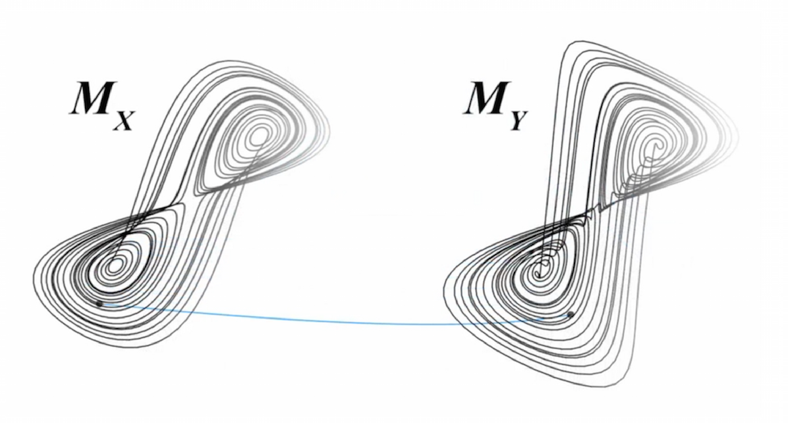

```{r setup, include = FALSE}
knitr::opts_chunk$set(echo = TRUE, warning = FALSE, 
                      tidy = TRUE, #cache = TRUE, 
                      fig.width = 5, fig.height = 3.5)
knitr::opts_knit$set(global.par = TRUE, progress = TRUE)
par(mar = c(4, 4, 1, 1), oma = c(0, 0, 0, 0), mgp = c(2.5, 1, 0))
```

# Abstract
Empirical dynamic modeling (EDM) is an emerging non-parametric framework for modeling nonlinear dynamic systems. EDM is based on the mathematical theory of recontructing attractor manifolds from time series data [@Takens_1981]. The **rEDM** package collects several EDM methods, including simplex projection [@Sugihara_1990], S-map [@Sugihara_1994], multivariate embeddings [@Dixon_1999], convergent cross mapping [@Sugihara_2012], and multiview embedding [@Ye_2016]. Here, we introduce the basic underlying theory, and describe the functionality of the **rEDM**, using examples from both model simulations and real data.

# Introduction
Many scientific fields use models as approximations of reality and for various purposes (e.g. testing hypotheses regarding mechanisms or processes, explaining past observations, predicting future outcomes). In most cases these models are based on hypothesized parametric equations; however explicit equations can be impractical when the exact mechanisms are unknown or too complex to be characterized with existing datasets. Empirical models, which infer patterns and associations from the data (instead of using hypothesized equations), represent an alternative and highly flexible approach. Here, we review the theoretical background for empirical dynamic modeling (EDM) and the functionality of the **rEDM** package, which are intended for nonlinear dynamic systems that can prove problematic for traditional modeling approaches.

The basic goal underlying EDM is to reconstruct the behavior of dynamic systems using time series data. This approach is based on mathematical theory developed initially by [@Takens_1981], and expanded on by others [@Sauer_1991; @Casdagli_1991; @Deyle_2011]. Because these methods operate with minimal assumptions, they are particularly suitable for studying systems that exhibit non-equilibrium dynamics and nonlinear state-dependent behavior (i.e. where interactions change over time and as a function of the system state).

## Installation Instructions

The **rEDM** package can be obtained in two main ways. The standard version of the package can be obtained through CRAN (the Comprehensive R Archive Network): https://cran.r-project.org/package=rEDM:

```{r CRAN installation instructions, eval = FALSE}
install.packages("rEDM")
```

However, the most recent version is available on GitHub: https://github.com/ha0ye/rEDM, and can be installed using the `install_github` function in the **devtools** package.

```{r GitHub installation instructions, eval = FALSE}
devtools::install_github("ha0ye/rEDM")
```

# Empirical Dynamic Modeling

## Time Series as Observations of a Dynamic System

The essential concept is that time series can be viewed as projections of the behavior of a dynamic system. Here, only a few modest assumptions are required. First, that the system state can be described as a point in a high-dimensional space. The axes of this space can be thought of as fundamental state variables; in an ecosystem, these variables might correspond to population abundances, resources, or environmental conditions. Second, that the system state changes through time following a set of deterministic rules. In other words, the behavior of the system is not completely stochastic.

Consequently, it is possible to project the system state onto one of the coordinate axes and obtain the value of the corresponding state variable. Sequential projections over time will thus produce a time series for that variable. For example, in Figure \ref{fig_time_series_projection}, the states of the canonical Lorenz Attractor [@Lorenz_1963] are projected to the $x$-axis, creating a time series of variable $x$.

```{r fig_time_series_projection, echo = FALSE, fig.cap = "Time Series Projection from the Lorenz Attractor"}
knitr::include_graphics("figure_1.svg")
```

In simple cases, different time series will represent different state variables. However, more generally, each time series is an *observation function* of the system state, and may, for example, be a function of several different state variables.

## Attractor Reconstruction / Takens' Theorem

The goal of EDM is to reconstruct the system dynamics from time series data. Because time series are sequential observations of the system behavior, information about the rules that govern system behavior (i.e. the system dynamics) is therefore encoded in the data. Takens' Theorem [@Takens_1981] provides a way to recover this information using just a single time series. Although the system behavior is nominally determined by a high-dimensional state space, we can substitute lags of a time series for any unknown or unobserved variables. For example, instead of representing the system state of the Lorenz Attractor using $x$, $y$, and $z$, we can instead use an embedding that consists of $E$ lags of $x$:
$$ \mathbf{x}_t = \left( x_t, x_{t-\tau}, \dots, x_{t-(E-1)\tau} \right) $$

```{r fig_attractor_reconstruction, echo = FALSE, fig.cap = "Attractor Reconstruction from Lagged Coordinates"}
knitr::include_graphics("figure_2.svg")
```

By Takens' Theorem [@Takens_1981], if sufficient lags are used, the reconstruction is a diffeomorphism of the original system. In other words, reconstructed states will map one-to-one to actual system states, and nearby points in the reconstruction will correspond to similar system states. Figure \ref{fig_attractor_reconstruction} shows a reconstruction of the Lorenz attractor where the reconstructed system state is comprised of 3 lags of variable $x$. There is a clear visual correspondence between the reconstruction and the original Lorenz attractor.

There are many applications for using this approach to recover system dynamics from time series. For example, empirical models can be used for forecasting [@Sugihara_1990], to understand nonlinear behavior [@Sugihara_1994], or to uncover mechanism [@Dixon_1999]. Recent work describes how EDM can be used to identify causal interactions, by testing whether two time series are observed from the same system [@Sugihara_2012]. In the next section, we demonstrate how the **rEDM** software package can be used to accomplish these tasks.

# EDM Examples

## Nearest Neighbor Forecasting using Simplex Projection

As mentioned previously, if enough lags are used, the reconstruction will map one-to-one to the original attractor. However, if the number of lags is insufficient (i.e. the embedding dimension is too small), then the reconstruction will have singularities -- points that actually correspond to different system states, but which overlap in the reconstruction. When this occurs, the reconstruction will fail to distinguish between different trajectories, and forecast performance will suffer. Thus, prediction skill can be used as an indicator for the optimal embedding dimension.

In the following example, we demonstrate how to select the embedding dimension. We use a nearest neighbor forecasting method, Simplex Projection [@Sugihara_1990], to produce forecasts, and examine prediction skill, defined here as the correlation between observed and predicted values.

### Example

In this example, time series come from a simulation of the classical tent map that exhibits chaotic behavior. The tent map is a discrete-time dynamic system, where a sequence, $x_t$, on the interval $[0, 1]$ is iterated according to:

\begin{equation*}
x_{t+1} = \begin{cases}
2x_t & x_t < \frac{1}{2}\\
2(1-x_t) & x_t \ge \frac{1}{2}
\end{cases}
\end{equation*}

In **rEDM**, a sample time series of the first-differenced values can be found in dataset `tentmap_del`.

We begin by loading the **rEDM** package:
```{r load package}
library(rEDM)
```

Then, we can load the tentmap data:
```{r load tentmap data}
data(tentmap_del)
str(tentmap_del)
```

We can see that the data consists of a single vector, containing the raw first-differences values of $x_t$. Because the `simplex` function can accept a single vector as the input time series, no further processing of the data is required.

```{r lib and pred for tentmap}
ts <- tentmap_del
lib <- c(1, 100)
pred <- c(201, 500)
```

We begin by initializing the `lib` and `pred` variables. These variables define the portions of the data that will be used to create the reconstruction. `lib` corresponds to the "training" portion of the data, on which nearest neighbors can be identified; and `pred` corresponds to the "test" portion of the data, on which 1-step ahead forecasts will be made. Here, the first 100 points (rows 1 to 100) in the time series constitute the "library set", and 300 points (rows 201 to 500) constitute the "prediction set".

The remaining parameters will be left at their default values (see section \ref{sec_general_parameters} for details). For the `simplex` function, this means that the embedding dimension, $E$, will range from $1$ to $10$.

*Note that if the code detects any overlap in the lib and pred, it will prevent a vector from becoming its own neighbor by enabling leave-one-out cross-validation and outputting a warning message.*

```{r simplex on tentmap}
simplex_output <- simplex(ts, lib, pred)
str(simplex_output)
```

The returned object from `simplex` is a data.frame with columns for each of the model parameters and forecast statistics, and rows for each separate model (i.e. different parameter combinations). For `simplex`, the model parameters are `E`, embedding dimension; `tau`, time lag between successive dimensions; `tp`, time to prediction; and `nn`, number of nearest neighbors (see section \ref{sec_general_parameters} for a detailed description). The forecast statistics are `num_pred`, the number of predictions made; `rho`, Pearson's correlation coefficient between predictions and observations; `mae`, mean absolute error of predictions; `rmse`, root mean squared error of predictions; `perc`, the percent of predictions that are the same sign as observations; and `p_val`, the p-value for `rho` being significantly greater than 0, using Fisher's transformation [@Fisher_1915]. The last 6 columns give those same forecast statistics, but for a naive constant predictor (where the 1-step ahead forecast is the current value) over the same set of predictions.

In this case, there are 10 separate models (one for each value of `E`), so we can plot `E` against `rho` (the correlation between observed and predicted values) to determine the optimal embedding dimension (i.e. the number of dimensions for which the reconstructed attractor is best unfolded, producing the highest forecast skill).

```{r rho vs. E for tentmap}
par(mar = c(4, 4, 1, 1), mgp = c(2.5, 1, 0)) # set up margins for plotting
plot(simplex_output$E, simplex_output$rho, type = "l",  
     xlab = "Embedding Dimension (E)", ylab = "Forecast Skill (rho)")
```

Here, we observe that forecast skill peaks at $E = 2$, indicating that the dynamics of our data are unfolded best in 2 dimensions. Note that this optimal value for `E` does not have to correspond to the dimensionality of the original system.  The forecast skill will be affected by factors such as observational noise, process error, and time series length, and so it is more useful to think of the embedding dimension here as a practical measure specific to the data.

## Prediction Decay

An important property of many natural systems is that nearby trajectories eventually diverge over time (i.e. "deterministic chaos" -- the "butterfly effect"). In essence, this means that while short-term prediction is often possible, long-term prediction may be impossible because information about the state of the system decays over time. We can demonstrate this effect by examining how prediction skill changes as the `tp` parameter is increased (`tp` is the parameter that describes the "time to prediction", the number of time steps into the future that forecasts are made).

### Example

Using the same data and the `simplex` function, we supply a range for the `tp` parameter and fix the embedding dimension to the value determined previously ($E = 2$):

```{r simplex varying tp for tentmap}
simplex_output <- simplex(ts, lib, pred, E = 2, tp = 1:10)
```

As above, the returned object is a data.frame, so we can examine prediction decay by plotting forecast skill (`rho`) against the time to prediction (`tp`).

```{r rho vs. tp for tentmap}
plot(simplex_output$tp, simplex_output$rho, type = "l", 
     xlab = "Time to Prediction (tp)", ylab = "Forecast Skill (rho)")
```

Because the parameters for the tent map fall in the region for chaotic behavior, there is a decline in forecast skill as `tp` increases.

## Identifying Nonlinearity

One concern is that many time series may show predictability even if they are purely stochastic, because they behave similarly to autocorrelated red noise. Fortunately, we can distinguish between red noise and nonlinear deterministic behavior by using S-maps as described in [@Sugihara_1994].

In contrast to the nearest-neighbor interpolation of simplex projection, the S-map forecasting method [@Sugihara_1994] fits local linear maps to describe the dynamics. In addition to the standard set of parameters for a lagged-coordinate reconstruction (as in `simplex`), S-maps also contain a nonlinear tuning parameter, $\theta$, that determines the degree to which points are weighted when fitting the local linear map. For example, when $\theta = 0$, all points are equally weighted, such that the local linear map is identical for different points in the reconstructed state-space. As such, the S-map will be identical to a global linear map (i.e. an autoregressive model). When values of $\theta$ are greater than $0$, nearby points in the state space receive larger weights, and the local linear map can vary in state-space to accommodate nonlinear behavior. 

Consequently, if the time series are sampled from autoregressive red noise, then the linear model ($\theta = 0$) should produce better forecasts, because the global linear map (which will, in effect, be fitted to more data points) will reduce the effects of observation error compared to local linear maps. In contrast, if forecast skill increases for $\theta > 0$, then the results are suggestive of nonlinear dynamics, because better forecasts are achieved when the local linear map can change depending on the location in state-space: it is a better description of state-dependent behavior.

### Example

The S-map method is implemented as the function `s_map` in the **rEDM** package. Much like in the previous use of `simplex`, we can leave many of the parameters at default settings (see section \ref{sec_general_parameters} for details). Here, by default the $\theta$ parameter (`theta`) will range from $0$ to $8$, enabling us to test for nonlinearity. Here again, we will use the tent map time series, and set $E = 2$ based on the results from simplex projection.

Note that the default value for `num_neighbors` is `0`. Typically, when using `s_map` to test for nonlinear behavior, we want to use all points in the reconstruction when constructing the local linear map, and allow the `theta` parameter to control the weighting assigned to individual points. This is in contrast to simplex projection, where only the nearest neighbors are used. Here the function recognizes that all values < 1 are nonsensical and all the points will be used instead.

Following from the previous example, we set `E = 2` based on the results from simplex projection. Again, note that we allow many of the parameters to take on default values (e.g., $\tau = 1$, $\text{tp} = 1$). If we had changed these for simplex projection, we would want to propagate them here. The default values for the nonlinear tuning parameter, $\theta$, range from $0$ to $8$, and are suitable for our purposes.

Note also, that the default value for `num_neighbors` is `0`. Typically, when using `s_map` to test for nonlinear behavior, we allow all points in the reconstruction to be used, subject only to the weighting based on distance. By using `0` for this parameter (an otherwise nonsensical value), the program will use all nearest neighbors.

```{r smap for tentmap}
smap_output <- s_map(ts, lib, pred, E = 2)
```

Again, the results are a data.frame with columns for each of the model parameters and forecast statistics, with rows for each run of the model. In this case, there is one run for each value of `theta`, so we can simply plot `theta` against `rho`:

```{r rho vs. theta for tentmap}
plot(smap_output$theta, smap_output$rho, type = "l", 
     xlab = "Nonlinearity (theta)", ylab = "Forecast Skill (rho)")
```

Here, we can see that forecast skill substantially improves as `theta` increases, indicating the presence of nonlinear dynamics. Typically, we would expect forecast skill to decrease at high values of `theta`, because as `theta`, the local linear map can become overfitted to the nearest points. However, because the example data are observed without any error, even a very localized linear map can continue to produce good forecasts. By simulating the addition of a small amount of observational error, a more typical `rho` vs. `theta` plot can be achieved:

```{r rho vs. theta with noise}
ts <- ts + rnorm(length(ts), sd = sd(ts) * 0.2)
smap_output <- s_map(ts, lib, pred, E = 2)
par(mar = c(4, 4, 1, 1), mgp = c(2.5, 1, 0))
plot(smap_output$theta, smap_output$rho, type = "l", 
     xlab = "Nonlinearity (theta)", ylab = "Forecast Skill (rho)")
```

## Generalized Takens' Theorem

Instead of creating an attractor by taking lags of a single time series, it is possible to combine lags from different time series, if they are all observed from the same system [@Sauer_1991; @Deyle_2011]. The practical reality of applying EDM to systems with finite data, noisy observations, and stochastic influences means that such "multivariate" reconstructions can often be a better description of the true dynamics than "univariate" reconstructions

In **rEDM**, the `block_lnlp` function generalizes the `simplex` and `s_map` functions, allowing generic reconstructions to be used with either the simplex projection or S-map methods The main data input for `block_lnlp` is a matrix or data.frame of the time series observations, where each column is a separate time series with rows representing "simultaneous" observations. In addition to the standard parameters for `simplex` or `s_map`, `block_lnlp` contains parameters to specify which column is to be forecast (`target_column`) as well as which columns to use to construct the attractor (`columns`). For both parameters, either a numerical index or the column name can be given. Note that if lagged coordinates are intended to be used, they need to be manually created as separate columns in the matrix or data.frame.

### Example

We begin by loading an example dataset of time series and lags from a coupled 3-species model system. Here, the `block_3sp` variable is a 10-column data.frame with 1 column for time, and 3 columns for each of the variables (unlagged, $t-1$, and $t-2$ lags). Note that the lagged columns begin with `NA` values because there are no observations of the variables for times $t < 1$. In **rEDM**, vectors that include `NA` values are excluded if they would be used for computation, but predictions will still be made if only the observed values are missing (see section \ref{sec_data_input} for more details).

```{r load block_3sp data}
data(block_3sp)
str(block_3sp)
```

In order to correctly index into columns, `block_lnlp` has an option to indicate that the first column is actually a time index. When `first_column_time` is set to `TRUE`, a value of `1` for `target_column` now points to the first *data* column in the data.frame, as opposed to the time column (`columns` is similarly indexed).

In order to correctly index into columns, `block_lnlp` has an option to indicate that the first column is actually a time index. When `first_column_time` is set to `TRUE`}, a value of `1` for `target_column` will refer to the first *data* column in the data.frame, and skip the "time" column (the parameter `columns` is similarly indexed). If column names are used, then the `first_column_time` parameter is ignored, except to label the output.

```{r block_lnlp for block_3sp, warning = FALSE}
lib <- c(1, NROW(block_3sp))
pred <- c(1, NROW(block_3sp))

cols <- c(1, 2, 4) # c("x_t", "x_t-1", "y_t")
target <- 1 # "x_t"

block_lnlp_output <- block_lnlp(block_3sp, lib = lib, pred = pred, 
                                columns = cols, target_column = target, 
                                stats_only = FALSE, first_column_time = TRUE)
```

Note that the default value for the `tp` parameter is `1`, indicating that predictions will be made for 1 time step into the future (i.e. the subsequent row of the input data). In some cases, the data may already be processed such that the predictions are already aligned in the same row, but a different column, in which case the `tp` parameter should be set to `0`.

```{r}
str(block_lnlp_output)
```

By setting `stats_only` to `FALSE`, the output includes a list column with the full model output. Note that unlike other columns, which are vectors of simple types (e.g. numeric, character), `model_output` is a vector of lists. Here, because only 1 model (1 combination of input parameters) was run, the column has 1 element, which is a list that contains a single element, the data.frame of the full set of observed and predicted values.

To compare the observed and predicted values, we must therefore index correctly into the output. We can then plot the observed and predicted values and see how well the model did relative to the expected 1:1 line.

```{r, echo = FALSE}
par(pty = "s")
```

```{r observed vs predicted for block_lnlp, fig.width = 4, fig.height = 4}
observed <- block_lnlp_output$model_output[[1]]$obs
predicted <- block_lnlp_output$model_output[[1]]$pred

plot_range <- range(c(observed, predicted), na.rm = TRUE)
plot(observed, predicted, xlim = plot_range, ylim = plot_range, 
     xlab = "Observed", ylab = "Predicted", asp = 1)
abline(a = 0, b = 1, lty = 2, col = "blue")
```


```{r, echo = FALSE}
par(pty = "m")
```

## Causality Inference and Cross Mapping

One of the corollaries to the Generalized Takens' Theorem is that it should be possible to cross predict or cross map between variables that are observed from the same system. Consider two variables, $x$ and $y$ that interact in a dynamic system. Then the univariate reconstructions based on $x$ or $y$ alone should uniquely identify the system state and and thus the corresponding value of the other variable.



In the case of unidirectional causality, e.g. $x$ causes $y$, the causal variable ($x$) leaves a signature on the affected variable ($y$). Consequently, the reconstructed states based on $y$ can be used to cross predict the values of $x$ (because the reconstruction based on $y$ must be complete, it must include information about the value of $x$). Note that this cross prediction is in the *opposite* direction of the causal effect. At the same time, cross prediction from $x$ to $y$ will fail, because the time series of $x$ behaves independently of $y$, so a univariate reconstruction using only lags of $x$ is necessarily incomplete.

Although $x$ has incomplete information for predicting $y$, it does affect the values of $y$, and therefore will likely to have nonzero predictive skill. However, this cross mapping will be limited to the statistical association between $x$ and $y$ and will generally not improve as longer time series are used for reconstruction. In contrast, the cross prediction of $x$ from $y$ will generally improve. This convergence is therefore a crucial property for inferring causality. For practical reasons, the sensitivity of detecting causality this way is improved if, instead of predicting the future value of another variable, we estimate the concurrent value of another variable. We refer to this modified method as cross mapping, because we are projecting from one state to another without necessarily "predicting" the future.

For a more detailed description of using cross mapping to infer causation, see [@Sugihara_2012].

## Convergent Cross Mapping (CCM)

In **rEDM**, convergent cross mapping is implemented as the `ccm` function, which provides an easy way to compute cross map skill for different subsamples of the time series. In the following example, we reproduce the analysis from [@Sugihara_2012], identifying causality between anchovy landings in California and Newport Pier sea-surface temperature. For this example, a previously identified value of `3` for the embedding dimension will be used.

To quantify convergence, we compute the cross map skill over many random subsamples of the time series. The `lib_sizes` parameter specifies the "library" size of the subsamples that we use, and the `num_samples` parameter specifies the number of subsamples to be generated at each library size. The `random_libs` and `replace` parameters specify how the subsamples will be generated. Here, setting both to `TRUE` means that random sampling with replacement will be used.

```{r sardine anchovy ccm, warning = FALSE}
data(sardine_anchovy_sst)
anchovy_xmap_sst <- ccm(sardine_anchovy_sst, E = 3, 
                        lib_column = "anchovy", target_column = "np_sst", 
                        lib_sizes = seq(10, 80, by = 10), num_samples = 100, 
                        random_libs = TRUE, replace = TRUE)
sst_xmap_anchovy <- ccm(sardine_anchovy_sst, E = 3, 
                        lib_column = "np_sst", target_column = "anchovy", 
                        lib_sizes = seq(10, 80, by = 10), num_samples = 100, 
                        random_libs = TRUE, replace = TRUE)
str(anchovy_xmap_sst)
```

The output from CCM is a data.frame with statistics for each model run (in this case, 100 models at each of 8 library sizes). To interpret the results, we aggregate the cross map performance at each library size using the `ccm_means` function, which computes a mean value for the forecast statistics. Because average cross map skill less than 0 means there is no prediction skill, (predictions should not be anticorrelated with observations), we filter out negative values when plotting.

```{r sardine anchovy ccm plot}
a_xmap_t_means <- ccm_means(anchovy_xmap_sst)
t_xmap_a_means <- ccm_means(sst_xmap_anchovy)

plot(a_xmap_t_means$lib_size, pmax(0, a_xmap_t_means$rho), type = "l", col = "red", 
     xlab = "Library Size", ylab = "Cross Map Skill (rho)", ylim = c(0, 0.25))
lines(t_xmap_a_means$lib_size, pmax(0, t_xmap_a_means$rho), col = "blue")
legend(x = "topleft", legend = c("anchovy xmap SST", "SST xmap anchovy"), 
       col = c("red", "blue"), lwd = 1, bty = "n", inset = 0.02, cex = 0.8)
```

# Real Data Examples

## Community Productivity and Invasibility

The data presented here are part of Experiment 120, the “Big Biodiversity” experiment at Cedar Creek LTER [@Tilman_1997], and the full data and metadata relating to the experiments that we discuss are available at https://www.cedarcreek.umn.edu/research/data. This experiment is the longest running randomized test for the effects of plant diversity on ecosystem functions. Plots were established in 1994 and planted with 1, 2, 4, 8, or 16 species, and have since then been sampled annually for above-ground plant biomass. The most well-known result from the experiment is that the number of planted species has strong positive influences on above-ground biomass production. However, because the diversity treatments are fixed (i.e. not allowed to vary dynamically), they do not lend themselves to EDM.

Instead, we focus on a different set of published results from the experiment: interactions between primary productivity, soil nitrate, and invasion rates. These show that increased biomass is associated with decreases in soil nitrate levels and decreases in invasion success [@Fargione_2005]. A posited mechanism for this is soil nitrate: increased primary productivity leads to decreased soil nitrate, which in turn reduces resources available to invaders. In order to increase sample size for these analyses, we combine data from the treatments with 4-8 planted species, which follow similar dynamics, and analyze the different plots together as spatial replicates [@Hsieh_2008].

The columns in the dataset `e120_biodiversity` are as follows: `Exp` indicates the experiment code, `Year` and `Month` are the sampling time, while `Plot`, `Field`, and `FieldPlot` describe plot identity. `NumSp` and `SpNum` show the planted and realized species diversity, respectively. `AbvBioAnnProd` shows annual aboveground productivity of planted species, in g/m$^2$. `noh020tot` shows soil nitrate levels in the top 20 cm of soil, measured in $\mu$g/kg soil. `invrichness` shows species richness of unplanted species in the plot. `SummerPrecip.mm.` shows precipitation annual from May to August measured in mm.

### Preparing the Data

E120 includes data from multiple plots, meaning that we first need to collapse it into a single composite time series. We begin by normalizing each time series to mean zero and standard deviation one. This facilitates mixing multiple spatial replicates in a single analyses in EDM.

```{r load e120 data}
data(e120_biodiversity)

normalize <- function(x, ...) {(x - mean(x, ...))/sd(x, ...)}

# separate time column from data
vars <- c("AbvBioAnnProd", "noh020tot", "invrichness", "SummerPrecip.mm.")
composite_ts <- e120_biodiversity[, vars]

# normalize each time series within a plot
data_by_plot <- split(composite_ts, e120_biodiversity$Plot)
normalized_data <- lapply(data_by_plot, function(df) sapply(df, normalize))
composite_ts <- cbind(Year = e120_biodiversity$Year, 
                      data.frame(do.call(rbind, normalized_data)))
```

To prevent lagged vectors from being constructed that span separate plots, we need to create an appropriate index variable that identifies different segments.

```{r make composite library}
segments_end <- cumsum(sapply(data_by_plot, NROW))
segments_begin <- c(1, segments_end[-length(segments_end)] + 1)
segments <- cbind(segments_begin, segments_end)

# Choose random segments for prediction
set.seed(2312)
rndlib <- sample(1:NROW(segments), floor(NROW(segments) * 0.75))
composite_lib <- segments[rndlib, ]
composite_pred <- segments[-rndlib, ]
```

Because the time series for precipitation does not vary among replicates, we also need to construct separate variables for analyzing precipitation dynamics:

```{r}
precip_ts <- unique(e120_biodiversity[, c("Year", "SummerPrecip.mm.")])
precip_ts <- precip_ts[order(precip_ts$Year), ]
```

### Applying Simplex and S-map Algorithms

We can then use the **rEDM** functions as normal for each of our time series. First, we apply simplex projection:

```{r simplex on e120, warning = FALSE, fig.width = 6}
simplex_out <- lapply(names(composite_ts)[2:4], function(var) {
    simplex(composite_ts[, c("Year", var)], E = 2:4, 
            lib = composite_lib, pred = composite_pred)
})
simplex_out[[length(simplex_out) + 1]] <- simplex(precip_ts, E = 2:5)
names(simplex_out) <- names(composite_ts)[-1]

par(mfrow = c(2, 2))
out <- lapply(names(simplex_out), function(var) {
    plot(simplex_out[[var]]$E, simplex_out[[var]]$rho, type = "l", 
         xlab = "Embedding Dimension (E)", ylab = "Forecast Skill (rho)", 
         main = var)
})
```

These results give us the best embedding dimension for each of our projections:

```{r best E for e120}
best_E <- sapply(simplex_out, function(df) {df$E[which.max(df$rho)]})
best_E
```

Note that for two variables (nitrogen and invasive richness), the best embedding dimension is also the maximum that we test. These results suggest that the dynamics might be high-dimensional, and that collecting longer time series might enable better predictions.

Using these embedding dimensions, we can now apply S-maps to identify nonlinearity:

```{r smap on e120, warning = FALSE, fig.width = 6, results = "hide"}
smap_out <- lapply(names(composite_ts)[2:4], function(var) {
    s_map(composite_ts[, c("Year", var)], E = best_E[var], 
            lib = composite_lib, pred = composite_pred)
})
smap_out[[length(smap_out)+1]] <- s_map(precip_ts, E = best_E[length(smap_out)+1])
names(smap_out) <- names(simplex_out)

par(mfrow = c(2, 2))
lapply(names(smap_out), function(var) {
    plot(smap_out[[var]]$theta, smap_out[[var]]$rho, type = "l", 
         xlab = "Nonlinearity (theta)", ylab = "Forecast Skill (rho)", 
         main = var)
})
```

Note that species richness, and precipitation time series suggest nonlinear dynamics in the data (because of the initial increase in forecast skill for non-zero `theta`, followed by a sharp drop-off). However, the strict fall-off in `rho` for non-zero `theta` in the case of `noh020tot` and `AbvBioAnnProd` suggest that soil nitrate levels and total biomass may have only linear dynamics,

### Multivariate Models

Our next step is to use information from several different variables to make better forecasts. We can do this using `block_lnlp`, but first need to manually constructed lagged vectors for each variable. This requires a bit of care in coding, as we need to ensure that lagged components come only from observations within a single field and transect.

```{r make block for e120}
data_by_plot <- split(composite_ts, e120_biodiversity$Plot)
block_data <- do.call(rbind, lapply(data_by_plot, function(df) {
    n <- NROW(df)
    temp <- data.frame(Year = df$Year)
    temp$AB_tm <- df$AbvBioAnnProd
    temp$AB_tm1 <- c(NA, temp$AB_tm[-n])
    temp$AB_tm2 <- c(NA, temp$AB_tm1[-n])
    temp$AB_tm3 <- c(NA, temp$AB_tm2[-n])
    
    temp$NO_tm <- df$noh020tot
    temp$NO_tm1 <- c(NA, temp$NO_tm[-n])
    temp$NO_tm2 <- c(NA, temp$NO_tm1[-n])
    temp$NO_tm3 <- c(NA, temp$NO_tm2[-n])
    
    temp$IV_tm <- df$invrichness
    temp$IV_tm1 <- c(NA, temp$IV_tm[-n])
    temp$IV_tm2 <- c(NA, temp$IV_tm1[-n])
    temp$IV_tm3 <- c(NA, temp$IV_tm2[-n])
    
    temp$PR_tm <- df$SummerPrecip.mm
    temp$PR_tm1 <- c(NA, temp$PR_tm[-n])
    temp$PR_tm2 <- c(NA, temp$PR_tm1[-n])
    temp$PR_tm3 <- c(NA, temp$PR_tm2[-n])
    
    return(temp)
}))
head(block_data[, 1:5], 20)
```

Now, we can run the `block_lnlp` on the composite, multivariate time series. First, we run the algorithm to predict primary productivity dynamics, based on its own lagged dynamics. Next, we add additional information about precipitation:

```{r block_lnlp for e120, warning = FALSE}
AB_columns <- c("AB_tm", "AB_tm1", "AB_tm2")
AB_output <- block_lnlp(block_data, lib = composite_lib, pred = composite_pred, 
                        columns = AB_columns, target_column = 1, 
                        stats_only = FALSE, first_column_time = TRUE)

ABNO_columns <- c("AB_tm", "AB_tm1", "AB_tm2", "NO_tm", "NO_tm1", "NO_tm2")
ABNO_output <- block_lnlp(block_data, lib = composite_lib, pred = composite_pred, 
                          columns = ABNO_columns, target_column = 1, 
                          stats_only = FALSE, first_column_time = TRUE)

```

Note that each additional variable adds slightly to the predictive power of the model.

```{r, echo = FALSE}
par(mfrow = c(1, 1), pty = "s")
```

```{r block_lnlp on e120, warning = FALSE, fig.width = 4, fig.height = 4}
observed_AB <- AB_output$model_output[[1]]$obs
predicted_AB <- AB_output$model_output[[1]]$pred

observed_ABNO <- ABNO_output$model_output[[1]]$obs
predicted_ABNO <- ABNO_output$model_output[[1]]$pred

plot_range <- range(c(observed_AB, predicted_AB), na.rm = TRUE)
plot(observed_AB, predicted_AB, xlim = plot_range, ylim = plot_range, 
     xlab = "Observed", ylab = "Predicted")
abline(a = 0, b = 1, lty = 2, col = "darkgrey", lwd = 2)
abline(lm(predicted_AB ~ observed_AB), col = "black", lty = 3, lwd = 2)

points(observed_ABNO, predicted_ABNO, pch = 2, col = "red")
abline(lm(predicted_ABNO ~ observed_ABNO), col = "red", lty = 3, lwd = 2)

legend("topleft", legend = c(paste("rho =", round(AB_output$rho, 2)), 
                             paste("rho =", round(ABNO_output$rho, 2))), 
       lty = 3, lwd = 2, col = c("black", "red"), bty = "n")
```


```{r, echo = FALSE}
par(mfrow = c(1, 1), pty = "m")
```

### Convergent Cross Mapping

Finally, we can apply CCM to our data to test for pairwise causal links among variables. For each individual test, we use the embedding dimension corresponding to the "best"" embedding dimension for the variable that we are cross mapping from (i.e. the putative affected process).

```{r ccm on e120, warning = FALSE}
# A. repens:
my_lib_sizes <- c(seq(5, 55, by = 2), seq(55, 400, by = 50))

no_xmap_inv <- ccm(composite_ts, lib = segments, pred = segments, 
                   lib_column = "noh020tot", target_column = "invrichness", 
                   E = best_E["noh020tot"], lib_sizes = my_lib_sizes, silent = TRUE)
inv_xmap_no <- ccm(composite_ts, lib = segments, pred = segments, 
                   lib_column = "invrichness", target_column = "noh020tot", 
                   E = best_E["invrichness"], lib_sizes = my_lib_sizes, silent = TRUE)

n_xmap_i_means <- ccm_means(no_xmap_inv)
i_xmap_n_means <- ccm_means(inv_xmap_no)

plot(n_xmap_i_means$lib_size, pmax(0, n_xmap_i_means$rho), type = "l", 
     xlab = "Library Size", ylab = "Cross Map Skill (rho)", 
     col = "red", ylim = c(0, 0.4), lwd = 2)
lines(i_xmap_n_means$lib_size, pmax(0, i_xmap_n_means$rho), 
      col = "blue", lwd = 2)
legend(x = "topleft", col = c("red", "blue"), lwd = 2, 
       legend = c("Nitrate xmap Inv. Richness", "Inv. Richness xmap Nitrate"), 
       inset = 0.02, bty = "n", cex = 0.8)
```

```{r ccm on e120 with biological productivity, warning = FALSE}
ab_xmap_inv <- ccm(composite_ts, lib = segments, pred = segments,
                   lib_column = "AbvBioAnnProd", target_column = "invrichness", 
                   E = best_E["AbvBioAnnProd"], lib_sizes = my_lib_sizes, silent = TRUE)
inv_xmap_ab <- ccm(composite_ts, lib = segments, pred = segments, 
                   lib_column = "invrichness", target_column = "AbvBioAnnProd", 
                   E = best_E["invrichness"], lib_sizes = my_lib_sizes, silent = TRUE)

a_xmap_i_means <- ccm_means(ab_xmap_inv)
i_xmap_a_means <- ccm_means(inv_xmap_ab)

plot(a_xmap_i_means$lib_size, pmax(0, a_xmap_i_means$rho), type = "l", 
     xlab = "Library Size", ylab = "Cross Map Skill (rho)", 
     col = "orange", ylim = c(0, 0.4), lwd = 2)
lines(i_xmap_a_means$lib_size, pmax(0, i_xmap_a_means$rho), 
      col = "blue", lwd = 2)
legend(x = "topleft", col = c("orange", "blue"), 
       legend = c("Abv. Biomass xmap Inv. Richness", 
                  "Inv. Richness xmap Abv. Biomass"), 
       lwd = 2, inset = 0.02, bty = "n", cex = 0.8)
```

In each case, results suggest that invasive richness is driven by other variables more strongly than it influences them in return. For soil nitrate, this makes sense, as invading species in these plots are quickly weeded out and should not have much time to influence local environmental conditions, whereas the establishment success of invading species should depend strongly on local nitrogen availability.

Our analyses for biomass and invasion may indicate either bidirectional forcing, or synchrony. Though there is a stronger rise in $\rho$ with library length for "Inv. Richness xmap Abv. Biomass" (i.e., "Biomass affects Invasive Richness"), there also does not appear to be a significant difference between $\rho$ at short library lengths and $\rho$ at large library lengths. Nevertheless, bidirectional causal forcing, with stronger effects of planted biomass on invasion than vice versa, would make sense, as weeding treatments should insure that there should only be moderate effects of invading species on plot-level biomass (e.g. by decreasing biomass of planted species through light competition), while effects of plot-level planted biomass on invader success should be much stronger (e.g. through competition for space or soil resources).

## Apple-Blossom Thrips

In this next example, we will use EDM methods to re-examine the classic apple-blossom thrips (Thrips imaginis) time series from the Wait Institute in Australia [@Davidson_1948; @Davidson_1948a]. Seasonal outbreaks of Thrips imaginis were observed to vary greatly in magnitude from year to year, but large outbreaks tended to coincide across large spatial domains. This lead to the hypothesis that regional-scale climatic factors were responsible for controlling the size of the seasonal outbreaks (what might now be called the Moran effect [@Moran_1953]).

```{r thrips data}
data(thrips_block)
colnames(thrips_block)
```

The first data column `r colnames(thrips_block)[3]` contains counts of Thrips imaginis obtained from the Global Population Dynamics Database (GPDD) [@NERC-Centre-for-Population-Biology_2010]. `r colnames(thrips_block)[4]` is the mean maximum daily temperature ($^\circ$C) taken over each month and `r colnames(thrips_block)[5]` is the monthly rainfall (mm), both from the Waite Institute. The final column `r colnames(thrips_block)[6]` is a simple annual sinusoid that peaks in December (the Austral summer) and acts as an indicator of season.

First, we plot the data.

```{r, echo = FALSE}
par(mfrow = c(4, 1))
```

```{r thrips plot, echo = FALSE, fig.width = 6, fig.height = 7}
time_dec <- thrips_block$Year + (thrips_block$Month)/12
plot(time_dec, thrips_block$Thrips_imaginis, type = "l", col = "green", ylab = "Thrips", xlab = "")
plot(time_dec, thrips_block$maxT_degC, type = "l", col = "red", ylab = "maxT (oC)", xlab = "")
plot(time_dec, thrips_block$Rain_mm, type = "l", col = "blue", ylab = "Rain (mm)", xlab = "")
plot(time_dec, thrips_block$Season, type = "l", col = "magenta", ylab = "Season")
mtext("Year", side = 1, outer = TRUE, line = 1)
```

```{r, echo = FALSE}
par(mfrow = c(1, 1))
```

Note that all the time-series variables, particularly the mean maximum daily Temperature, show marked seasonality.

### Univariate Analysis

```{r univariate thrips, warning = FALSE}
ts <- thrips_block$Thrips_imaginis
lib <- c(1, length(ts))
pred <- c(1, length(ts))
simplex_output <- simplex(ts, lib, pred, tau = 1)
```

```{r rho vs. e for thrips, echo = FALSE}
plot(simplex_output$E, simplex_output$rho, type = "l", 
     xlab = "Embedding Dimension (E)", ylab = "Forecast Skill (rho)")
```

While there is an initial peak in the simplex prediction at `E = 4`, the global maximum is at `E = 8`. This suggests that both `E = 4` and `E = 8` are practical embedding dimensions.

To test for nonlinearity, we examine both `E = 4` and `E = 8` to verify that the S-maps result is robust to the choice of embedding dimension.

```{r smap for thrips, warning = FALSE}
smap_output <- list()
smap_output[[1]] <- s_map(ts, lib, pred, E = 4)
smap_output[[2]] <- s_map(ts, lib, pred, E = 8)
```

```{r, echo = FALSE}
par(mfrow = c(1, 2))
```

```{r rho vs. theta for thrips, echo = FALSE}
plot(smap_output[[1]]$theta, smap_output[[1]]$rho, type = "l", xlim = c(0, 4), 
     xlab = "Nonlinearity (theta)", ylab = "Forecast Skill (rho)")
plot(smap_output[[2]]$theta, smap_output[[2]]$rho, type = "l", xlim = c(0, 4), 
     xlab = "Nonlinearity (theta)", ylab = "Forecast Skill (rho)")
```

```{r, echo = FALSE}
par(mfrow = c(1, 1))
```

The S-map results demonstrate clear nonlinearity in the Thrips time series, as nonlinear models `\theta > 0` give substantially better predictions than the linear model `\theta = 0`. This suggests that *Thrips*, despite the strong seasonal dynamics, do not simply track the environment passively, but have some intrinsic dynamics. To look more closely at the issue of seasonal drivers, however, we turn to convergent cross-mapping (CCM).

### Seasonal Drivers

Recall that there is a two-part criterion for CCM to be a rigorous test of causality. (1) The cross map prediction skill is statistically significant when using the full time series as the library. (2) Cross map prediction demonstrates convergence, i.e. prediction skill increases as more of the time series is used for the library and the reconstructed attractor becomes more dense.

For an initial summary, we first compute the cross map skill (measured with Pearson's $\rho$) for each variable pair, using the full time series as the library.

```{r compute ccm matrix for thrips, results = "hold", warning = FALSE}
vars <- colnames(thrips_block[3:6])
n <- NROW(thrips_block)
ccm_matrix <- array(NA, dim = c(length(vars), length(vars)), 
                    dimnames = list(vars, vars))

for(ccm_from in vars)
{
    for(ccm_to in vars[vars != ccm_from])
    {
        out_temp <- ccm(thrips_block, E = 8, 
                        lib_column = ccm_from, target_column = ccm_to,
                        lib_sizes = n, replace = FALSE, silent = TRUE)
        ccm_matrix[ccm_from, ccm_to] <- out_temp$rho
    }
}
```


For comparison we also compute the lagged cross-correlation, allowing lags of up to $\pm 6$ months.

```{r compute corr matrix for thrips}
corr_matrix <- array(NA, dim = c(length(vars), length(vars)), 
                     dimnames = list(vars, vars))

for(ccm_from in vars)
{
    for(ccm_to in vars[vars != ccm_from])
    {
        cf_temp <- ccf(thrips_block[,ccm_from], thrips_block[,ccm_to], 
                       type = "correlation", lag.max = 6, plot = FALSE)$acf
        corr_matrix[ccm_from, ccm_to] <- max(abs(cf_temp))
    }
}
```

We compare the two matrices.

```{r xmap vs. corr matrix for thrips}
head(ccm_matrix)
head(corr_matrix)
```

Notice that the lagged correlation between temperature and the seasonal indicator is extremely high. Thus, it is not surprising that the cross map results indicate that the seasonal variable can almost perfectly recover the temperature, $\rho = `r format(corr_matrix["Season", "maxT_degC"], 2)`$. This makes interpretation more complicated, because we have to consider the possibility that cross mapping is simply identifying the shared seasonality between two time series. In other words, we may be able to cross map between temperature and any variable with a seasonal cycle, even if there is no actual causal mechanism.


#### Convergent Cross-Mapping
With this in mind, we examine convergence in cross-map predictability, i.e. we compute `rho` as a function of library size `L`. We first look at *Thrips* and temperature.

```{r ccm on thrips, results = "hide", warning = FALSE}
thrips_xmap_maxT <- ccm(thrips_block, E = 8, random_libs = TRUE, 
                        lib_column = "Thrips_imaginis", target_column = "maxT_degC", 
                        lib_sizes = seq(10, 75, by = 5), num_samples = 300)
maxT_xmap_thrips <- ccm(thrips_block, E = 8, random_libs = TRUE, 
                        lib_column = "maxT_degC", target_column = "Thrips_imaginis", 
                        lib_sizes = seq(10, 75, by = 5), num_samples = 300)

ccm_out <- list(ccm_means(thrips_xmap_maxT), ccm_means(maxT_xmap_thrips))
```

```{r ccm plot, echo = FALSE}
plot(ccm_out[[1]]$lib_size, pmax(0, ccm_out[[1]]$rho), type = "l", col = "red",  
     xlab = "Library Size", ylab = "Cross Map Skill (rho)", ylim = c(0, 1))
lines(ccm_out[[2]]$lib_size, pmax(0, ccm_out[[2]]$rho), col = "blue")
abline(h = corr_matrix['Thrips_imaginis', 'maxT_degC'], col = "black", lty = 2)
legend(x = "bottomright", legend = c("Thrips xmap maxT", "maxT xmap Thrips"), 
       col = c("red", "blue"), lwd = 1, inset = 0.02)
```

The magnitude of the cross-correlation between *Thrips* and temperature is shown as a black dashed line for comparison. We repeat the analysis for rainfall.

```{r ccm on thrips and rainfall, results = "hide", warning = FALSE}
thrips_xmap_Rain <- ccm(thrips_block, E = 8, random_libs = TRUE, 
                        lib_column = "Thrips_imaginis", target_column = "Rain_mm", 
                        lib_sizes = seq(10, 75, by = 5), num_samples = 300)
Rain_xmap_thrips <- ccm(thrips_block, E = 8, random_libs = TRUE, 
                        lib_column = "Rain_mm", target_column = "Thrips_imaginis", 
                        lib_sizes = seq(10, 75, by = 5), num_samples = 300)

ccm_out <- list(ccm_means(thrips_xmap_Rain), ccm_means(Rain_xmap_thrips))
```

```{r rainfall and thrips ccm plot, echo = FALSE}
plot(ccm_out[[1]]$lib_size, pmax(0, ccm_out[[1]]$rho), type = "l", col = "red", 
     xlab = "Library Size", ylab = "Cross Map Skill (rho)", ylim = c(0, 1))
lines(ccm_out[[2]]$lib_size, pmax(0, ccm_out[[2]]$rho), col = "blue")
abline(h = corr_matrix['Thrips_imaginis','Rain_mm'], col = 'black', lty = 2)
legend(x = "topleft", legend = c("Thrips xmap Rain", "Rain xmap Thrips"),
 col = c("red", "blue"), lwd = 1, inset = 0.02)
```

And finally for the deterministic seasonal cycle.

```{r ccm on thrips and season, results = "hide", warning = FALSE}
thrips_xmap_Season <- ccm(thrips_block, E = 8, random_libs = TRUE, 
                          lib_column = "Thrips_imaginis", target_column = "Season", 
                          lib_sizes = seq(10, 75, by = 5), num_samples = 300)
Season_xmap_thrips <- ccm(thrips_block, E = 8, random_libs = TRUE, 
                          lib_column = "Season", target_column = "Thrips_imaginis", 
                          lib_sizes = seq(10, 75, by = 5), num_samples = 300)

ccm_out <- list(ccm_means(thrips_xmap_Season), ccm_means(Season_xmap_thrips))
```

```{r season and thrips ccm plot, echo = FALSE}
par(mar = c(4, 4, 1, 1), mgp = c(2.5, 1, 0)) # set up margins for plotting
plot(ccm_out[[1]]$lib_size, pmax(0, ccm_out[[1]]$rho), type = "l", col = "red", 
     xlab = "Library Size", ylab = "Cross Map Skill (rho)", ylim = c(0, 1))
lines(ccm_out[[2]]$lib_size, pmax(0, ccm_out[[2]]$rho), col = "blue")
abline(h = corr_matrix['Thrips_imaginis', 'Season'], col = 'black', lty = 2)
legend(x = "bottomright", col = c("red", "blue"), lwd = 1, inset = 0.02, 
       legend = c("Thrips xmap Season", "Season xmap Thrips"))
```

The results show clear evidence of convergence for *Thrips* cross mapping the climactic variables, with the $\rho$ at maximum `L` greatly exceeding the simple linear correlation.

However, we are still left with the conundrum that temperature and to a lesser extent, rainfall, are easily predicted from the seasonal cycle, and so we cannot immediately ignore the possibility that the cross map results are an artifact of shared seasonal forcing.

To reframe, we wish to reject the null hypothesis that the level of cross mapping we obtain for `maxT_degC` and `Rain_mm` can be solely explained by shared seasonality. This hypothesis is readily tested using randomization tests based on surrogate data. The idea here is to generate surrogate time series with the same level of shared seasonality. Cross mapping between the real time series and these surrogates thus generates a null distribution for $\rho$, against which the actual cross map $\rho$ value can be compared.

#### Seasonal Surrogate Test

```{r seasonal surrogates for thrips, warning = FALSE}
num_surr <- 1000
surr_maxT <- make_surrogate_data(thrips_block$maxT_degC, method = "seasonal", T_period = 12, num_surr = num_surr)
surr_Rain <- make_surrogate_data(thrips_block$Rain_mm, method = "seasonal", T_period = 12, num_surr = num_surr)

rho_surr <- data.frame(maxT = numeric(num_surr), Rain = numeric(num_surr))

for (i in 1:num_surr) {
    rho_surr$maxT[i] <- ccm(cbind(thrips_block$Thrips_imaginis, surr_maxT[,i]), E = 8, lib_column = 1, target_column = 2, lib_sizes = NROW(thrips_block), replace = FALSE)$rho

    rho_surr$Rain[i] <- ccm(cbind(thrips_block$Thrips_imaginis, surr_Rain[,i]), E = 8, lib_column = 1, target_column = 2, lib_sizes = NROW(thrips_block), replace = FALSE)$rho
    }
```

We now have a null distribution, and can easily estimate the $p$ value for rejecting the null hypothesis of mutual seasonality.

```{r significance of randomization test}
(sum(ccm_matrix['Thrips_imaginis','Rain_mm'] < rho_surr$Rain) + 1) / 
    (length(rho_surr$Rain) + 1)
(sum(ccm_matrix['Thrips_imaginis','maxT_degC'] < rho_surr$maxT) + 1) / 
    (length(rho_surr$maxT) + 1)
```

In both cases, the CCM we measure for the real time series are better than the median expectation under the null hypothesis. For rainfall, moreover, the effect is clearly significant based on the common threshold of $p < 0.05$. Howover, the high correlation between the maximum daily temperature averaged over a month and the seasonal cycle makes it harder to establish significance for the effect of $maxT$. We note that the original Thrips data collections were at a much higher frequency than those available through the GPDD, and that $maxT$ shows much larger departures from the seasonal cycle on shorter time-scales. With more highly resolved data, it may well be possible to establish significance.

# Technical Details

## Data Input

The **rEDM** functions are designed to accept data in common R data formats, namely vectors, matrices, and data.frames. Depending on the specific function, one or the other data type is preferred. Please see the documentation associated with individual functions for more details.

Missing data can be input using either `NA` or `NAN`. The program will automatically ignore such missing values as appropriate. For instance, simplex projection will not select nearest neighbors if any of the state vector coordinates is missing or if the corresponding target value is missing.

Note that when there is no observed target value, it is still possible to predict from a given state vector, if it has no missing values. Thus, it is possible to use the software to forecast ahead from an observed state into an unobserved future. This can be done simply by substituting `NA` or `NAN` for unknown future values. However, be aware that the performance metrics will be computed so as to ignore such predictions (since there are no observed values to compare against). Thus, the statistics (e.g., $\rho$, MAE, RMSE) may be computed based on fewer predictions than those actually made by the software.

## General Parameters

Many of the functions in **rEDM** are designed around the same prediction engine, and so share many of the following parameters. Please see the documentation associated with individual functions to verify which parameters are applicable as well as the default values (which can change from function to function)

* lib
    + a 2-column matrix (or 2-element vector) where each row specifies the portions of the time series to use for attractor reconstruction (i.e., the set of vectors that can be selected as nearest neighbors)
    + e.g., `(1, n)` specifies that the first n *rows* (from 1 to n) of data are a contiguous time series block, each point of which can be used to construct state vectors
    + by default, lib uses the entire input as a single contiguous segment
* pred
    + (same format as lib, but specifes the portions of the time series to make predictions for)
* norm_type
    + `"L2 norm"` (default) or `"L1 norm"`: specifies which distance metric to use when doing calculations
    + `"L2 norm"` is the standard Euclidean distance, where the distance between a vector $\vec{x} = \langle x_1, x_2, \dots, x_n \rangle$ and $\vec{y} = \langle y_1, y_2, \dots, y_n \rangle$ is computed as $\sqrt{(x_1 - y_1)^2 + (x_2 - y_2)^x + \dots + (x_n - y_n)^2}$.
    + `"L1 norm"` is the Manhattan norm (also known as taxicab distance), where the distance between a vector $\vec{x} = \langle x_1, x_2, \dots, x_n \rangle$ and $\vec{y} = \langle y_1, y_2, \dots, y_n \rangle$ is computed as $|x_1 - y_1| + |x_2 - y_2| + \dots + |x_n - y_n|$.
* E
    + the embedding dimension to use for attractor reconstruction
* tau
    + the lag to use for attractor reconstruction; by default, tau is set to `1`
* tp
    + the prediction horizon (how many steps ahead to make forecasts)
    + negative values will also work
* num_neighbors
    + the number of neighbors to use
    + `"e+1"`, `"E+1"`, `"e + 1"`, and `"E + 1"` will all peg this parameter to be `E+1` for each run
    + values less than 1 will use all possible neighbors
* theta
    + the nonlinear tuning parameter (for use with S-maps) that adjusts how distance is factored into computation of the local linear map (`0` corresponds to a globally linear map, while values greater than 0 correspond to nonlinear models where the local linear map changes as a function of state-space)
* stats_only
    + `TRUE` (default) or `FALSE`: specifies whether the output should just contain statistics of the predictions, or also contain all the predictions that were made
* exclusion_radius
    + `exclusion_radius` sets the threshold whereby all vectors with time indices too close to the predictee will be excluded from being considered nearest neighbors
    + e.g., `1` means that vectors must have an associated time index more than 1 away from potential nearest neighbors
    + by default, exclusion_radius is set to NULL (turning this filtering off)
* epsilon
    + `epsilon` sets the threshold whereby all vectors with distance too far away from the predictee will be excluded from being considered nearest neighbors
    + e.g., `2` means that vectors must have be within a distance of 2 from potential nearest neighbors
    + by default, epsilon is set to NULL (turning this filtering off)
* silent
    + `TRUE` or `FALSE` (default): specifies whether to suppress warning messages from being printed to the R console
* save_smap_coefficients
    + `TRUE` or `FALSE` (default): specifies whether to include a table of S-map coefficients with the output
    + (note that setting this to `TRUE` forces the full output as if `stats_only = FALSE`)

<!-- # Applications -->

<!-- ## Composite Time Series -->

<!-- In some cases, we may have multiple time series that can serve as spatial or ecological replicates. To treat these time series as replicates when applying EDM, we want to combine the data together into a single composite time series. Because the scale may differ across time series, we typically apply a normalization routine to linearly transform each time series to have mean = 0 and variance = 1 before concatenating.  -->

<!-- ```{r load and composite sockeye data} -->
<!-- data(sockeye_returns) -->

<!-- # separate time column from data -->
<!-- time <- sockeye_returns$year -->
<!-- sockeye_returns <- sockeye_returns[,-1] -->

<!-- # normalize each time series -->
<!-- n <- NCOL(sockeye_returns) -->
<!-- for (j in 1:n) -->
<!--     { -->
<!--     sockeye_returns[,j] <- (sockeye_returns[,j] - mean(sockeye_returns[,j])) / sd(sockeye_returns[,j]) -->
<!--     } -->

<!-- # make composite time series -->
<!-- composite_ts <- data.frame(year = time,  -->
<!--                            returns = stack(sockeye_returns)$value) -->
<!-- ``` -->

<!-- Before applying EDM, however, we want to make sure that EDM will properly recognize the different time series segments as being different, so that lagged vectors are not constructed that contain coordinates spanning multiple time series. This is simply handled by constructing the lib and pred so that the first column designates the start of each time series segment, and the second column designates the end. -->

<!-- ```{r composite lib and pred for sockeye} -->
<!-- # make composite library -->
<!-- segments <- cbind(seq(from = 1, by = NROW(sockeye_returns), length.out = n),  seq(from = NROW(sockeye_returns), by = NROW(sockeye_returns), length.out = n)) -->
<!-- composite_lib <- segments[1:5,] -->
<!-- composite_pred <- segments[6:9,] -->
<!-- ``` -->

<!-- We can then use the **rEDM** functions as normal: -->

<!-- ```{r simplex for composite sockeye, fig.width = 6} -->
<!-- simplex_output <- simplex(composite_ts, composite_lib, composite_pred) -->
<!-- par(mar = c(4,4,1,1), mgp = c(2.5, 1, 0)) -->
<!-- plot(simplex_output$E, simplex_output$rho, type = "l",  xlab = "Embedding Dimension (E)", ylab = "Forecast Skill (rho)") -->
<!-- ``` -->

<!-- ```{r smap for composite sockeye, fig.width = 6} -->
<!-- smap_output <- s_map(composite_ts, composite_lib, composite_pred, E = 8) -->
<!-- par(mar = c(4,4,1,1), mgp = c(2.5, 1, 0)) -->
<!-- plot(smap_output$theta, smap_output$rho, type = "l", xlab = "Nonlinearity (theta)", ylab = "Forecast Skill (rho)") -->
<!-- ``` -->

# Acknowledgements

**rEDM** is the latest incarnation of EDM code. Past versions have been developed by George Sugihara, Alan Trombla, Richard Penner, Victor Wong, Martin Casdagli, Jerome Cartagena, Mohsen Azarbayejani, Ava Pierce, Jennifer Trezzo, and Hao Ye.

We thank Jun Cai, Jane Cowles, Andrew Edwards, Oliver Keyes, James Stagge, Ethan White, and Yair Daon for their suggestions and contributions to the package and its documentation.

# References
