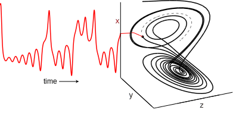

```{r setup, include = FALSE}
knitr::opts_chunk$set(echo = TRUE, warning = FALSE,
                      tidy = TRUE, 
                      fig.width = 5, fig.height = 3.5)
knitr::opts_knit$set(global.par = TRUE, progress = FALSE)
options(digits = 2)
par(mar = c(4, 4, 1, 1), oma = c(0, 0, 0, 0), mgp = c(2.5, 1, 0))
```

# Abstract
Empirical dynamic modeling (EDM) is an emerging non-parametric framework for modeling nonlinear dynamic systems. EDM is based on the mathematical theory of recontructing attractor manifolds from time series data [@Takens_1981]. The **rEDM** package collects several EDM methods, including simplex projection [@Sugihara_1990], S-map [@Sugihara_1994], multivariate embeddings [@Dixon_1999], convergent cross mapping [@Sugihara_2012], and multiview embedding [@Ye_2016]. Here, we introduce the basic underlying theory, and describe the functionality of **rEDM**, using examples from both model simulations and real data.

# Introduction
Many scientific fields use models as approximations of reality and for various purposes (e.g. testing hypotheses regarding mechanisms or processes, explaining past observations, predicting future outcomes). In most cases these models are based on hypothesized parametric equations; however explicit equations can be impractical when the exact mechanisms are unknown or too complex to be characterized with existing datasets. Empirical models, which infer patterns and associations from the data (instead of using hypothesized equations), represent an alternative and highly flexible approach. Here, we review the theoretical background for empirical dynamic modeling (EDM) and the functionality of the **rEDM** package, which are intended for nonlinear dynamic systems that can prove problematic for traditional modeling approaches.

The basic goal underlying EDM is to reconstruct the behavior of dynamic systems using time series data. This approach is based on mathematical theory developed initially by [@Takens_1981], and subsequently expanded [@Sauer_1991; @Casdagli_1991; @Deyle_2011]. Because these methods operate with minimal assumptions, they are particularly suitable for studying systems that exhibit non-equilibrium dynamics and nonlinear state-dependent behavior (i.e. where interactions change over time and as a function of the system state).

## Installation

The **rEDM** package can be obtained in two main ways. The standard version of the package can be obtained through CRAN (the Comprehensive R Archive Network): https://cran.r-project.org/package=rEDM:

```{r CRAN installation instructions, eval = FALSE}
install.packages("rEDM")
```

However, the most recent version is available on GitHub: https://github.com/ha0ye/rEDM, and can be installed using the `install_github()` function in the **devtools** package.

```{r GitHub installation instructions, eval = FALSE}
devtools::install_github("ha0ye/rEDM")
```

# Empirical Dynamic Modeling

## Time Series as Observations of a Dynamic System

The essential concept is that time series can be viewed as projections of the behavior of a dynamic system. Here, only a few modest assumptions are required. First, the system state can be described as a point in a high-dimensional space. The axes of this space can be thought of as fundamental state variables; in an ecosystem, these variables might correspond to population abundances, resources, or environmental conditions. Second, the system state changes through time following a set of deterministic rules. In other words, the behavior of the system is not completely stochastic.

Consequently, it is possible to project the system state onto one of the coordinate axes and obtain the value of the corresponding state variable. Sequential projections over time will thus produce a time series for that variable. For example, in the below figure, the states of the canonical Lorenz Attractor [@Lorenz_1963] are projected to the $x$-axis, creating a time series of variable $x$.

```{r fig_time_series_projection, echo = FALSE, fig.cap = "Time Series Projection from the Lorenz Attractor"}

```

In simple cases, each time series will represent a different state variable. However, more generally, each time series is an *observation function* of the system state, and may be a function of several different state variables. 

## Attractor Reconstruction / Takens' Theorem

The goal of EDM is to reconstruct the system dynamics from time series data. Because time series are sequential observations of the system behavior, information about the rules that govern system behavior (i.e. the system dynamics) is therefore encoded in the data. Takens' Theorem [@Takens_1981] provides a way to recover this information using just a single time series. Although the system behavior is nominally determined by a high-dimensional state space, we can substitute lags of a time series for any unknown or unobserved variables. For example, instead of representing the system state of the Lorenz Attractor using $x$, $y$, and $z$, we can instead use an embedding that consists of $E$ lags of $x$:
$$ \mathbf{x}_t = \left( x_t, x_{t-\tau}, \dots, x_{t-(E-1)\tau} \right) $$

```{r fig_attractor_reconstruction, echo = FALSE, fig.cap = "Attractor Reconstruction from 3 Lagged Coordinates"}
knitr::include_graphics("figure_2.svg")
```

By Takens' Theorem [@Takens_1981], if sufficient lags are used, the reconstruction is a diffeomorphism of the original system. In other words, reconstructed states will map one-to-one to actual system states, and nearby points in the reconstruction will correspond to similar system states. The above figure shows a reconstruction of the Lorenz attractor where the reconstructed system state is comprised of 3 lags of variable $x$. There is a clear visual correspondence between the reconstruction and the original Lorenz attractor.

There are many applications for using this approach to recover system dynamics from time series. For example, empirical models can be used for forecasting [@Sugihara_1990], to understand nonlinear behavior [@Sugihara_1994], or to uncover mechanism [@Dixon_1999]. Recent work describes how EDM can be used to identify causal interactions, by testing whether two time series are observed from the same system [@Sugihara_2012]. In the next section, we demonstrate how the **rEDM** software package can be used to accomplish these tasks.

# EDM Examples

## Nearest Neighbor Forecasting using Simplex Projection

As mentioned previously, if enough lags are used, the reconstruction will map one-to-one to the original attractor. However, if the number of lags is insufficient (i.e. the embedding dimension is too small), then the reconstruction will have singularities -- points that actually correspond to different system states, but which overlap in the reconstruction. When this occurs, the reconstruction will fail to distinguish between different trajectories, and forecast performance will suffer. Thus, prediction skill can be used as an indicator for the optimal embedding dimension.

In the following example, we demonstrate how to select the embedding dimension. We use a nearest neighbor forecasting method, Simplex Projection [@Sugihara_1990], to produce forecasts, and examine prediction skill, computed as the correlation between observed and predicted values.

### Example

In this example, time series come from a simulation of the tent map that exhibits chaotic behavior. The tent map is a discrete-time dynamic system, where a sequence, $x_t$, on the interval $[0, 1]$ is iterated according to:

\begin{equation*}
x_{t+1} = \begin{cases}
2x_t & x_t < \frac{1}{2}\\
2(1-x_t) & x_t \ge \frac{1}{2}
\end{cases}
\end{equation*}

In **rEDM**, a sample time series of the first-differenced values can be found in dataset `tentmap_del`.

We begin by loading the **rEDM** package:
```{r load package}
library(rEDM)
```

Then, we can load the tentmap data:
```{r load tentmap data}
data(tentmap_del)
str(tentmap_del)
```

We can see that the data consists of a single vector, containing the raw first-differences values of $x_t$. Because the `simplex()` function can accept a single vector as the input time series, no further processing of the data is required.

```{r lib and pred for tentmap}
ts <- tentmap_del
lib <- c(1, 100)
pred <- c(201, 500)
```

We begin by initializing the `lib` and `pred` variables. These variables define the portions of the data that will be used to create the reconstruction. `lib` corresponds to the "training" portion of the data, on which nearest neighbors can be identified; and `pred` corresponds to the "test" portion of the data, on which 1-step ahead forecasts will be made. Here, the first 100 points (positions 1 to 100) in the time series constitute the "library set", and 300 points (positions 201 to 500) constitute the "prediction set".

The remaining arguments will be left at their default values (see section "General Parameters" for details). For the `simplex()` function, this means that the embedding dimension, $E$, will range from $1$ to $10$.

*Note that if the code detects any overlap in the lib and pred, it will prevent a vector from becoming its own neighbor by enabling leave-one-out cross-validation and outputting a warning message.*

```{r simplex on tentmap}
simplex_output <- simplex(ts, lib, pred)
str(simplex_output)
```

The output is a data.frame with columns for each of the model parameters and forecast statistics, and rows for each separate model (i.e. different parameter combinations). For Simplex Projection, the model parameters are `E`, embedding dimension; `tau`, time lag between successive dimensions; `tp`, time to prediction; and `nn`, number of nearest neighbors. The forecast statistics are `num_pred`, the number of predictions made; `rho`, Pearson's correlation coefficient between predictions and observations; `mae`, mean absolute error of predictions; `rmse`, root mean squared error of predictions; `perc`, the percent of predictions that are the same sign as observations; and `p_val`, the p-value for `rho` being significantly greater than 0, using Fisher's transformation [@Fisher_1915]. For the purpose of comparison, the last 6 columns give those same forecast statistics, but for a naive constant predictor (where the 1-step ahead forecast is the current value) over the same set of predictions.

In this case, there are 10 separate models (one for each value of `E`), so we can plot `E` against `rho` (the correlation between observed and predicted values) to determine the optimal embedding dimension (i.e. the number of dimensions for which the reconstructed attractor is best unfolded, producing the highest forecast skill).

```{r rho vs. E for tentmap}
par(mar = c(4, 4, 1, 1), mgp = c(2.5, 1, 0)) # set margins for plotting
plot(simplex_output$E, simplex_output$rho, type = "l",  
     xlab = "Embedding Dimension (E)", ylab = "Forecast Skill (rho)")
```

Here, we observe that forecast skill peaks at $E = 2$, indicating that the dynamics of our data are unfolded best in 2 dimensions. *Note that this optimal value does not have to correspond to the dimensionality of the original system.*  The forecast skill will be affected by factors such as observational noise, process error, and time series length, and so it is more useful to think of the embedding dimension as a practical measure that is dependent on properties of the data.

## Prediction Decay

An important property of many natural systems is that nearby trajectories eventually diverge over time (i.e. "deterministic chaos" -- the "butterfly effect"). In essence, this means that while short-term prediction is often possible, information about the state of the system is continually lost over time, hindering long-term prediction. We can demonstrate this effect by examining how prediction skill changes as we increase the `tp` argument, the "time to prediction", the number of time steps into the future that forecasts are made.

### Example

Using the same data and the `simplex()` function, we supply a range for the `tp` argument and fix the embedding dimension to the value determined previously ($E = 2$):

```{r simplex varying tp for tentmap}
simplex_output <- simplex(ts, lib, pred, E = 2, tp = 1:10)
```

As above, the returned object is a data.frame, so we can examine prediction decay by plotting forecast skill (`rho`) against the time to prediction (`tp`).

```{r rho vs. tp for tentmap}
plot(simplex_output$tp, simplex_output$rho, type = "l",
     xlab = "Time to Prediction (tp)", ylab = "Forecast Skill (rho)")
```

Because the parameters for the tent map fall in the region for chaotic behavior, there is a noticeable decline in forecast skill as `tp` increases.

## Identifying Nonlinearity

One concern is that time series may show predictability even if they are purely stochastic, because they have temporal autocorrelation (i.e. similar to autocorrelated red noise). We can distinguish between red noise and nonlinear deterministic behavior by using S-maps as described in [@Sugihara_1994].

In contrast to the nearest-neighbor interpolation of simplex projection, the S-map forecasting method [@Sugihara_1994] fits local linear maps to forecast from the reconstructed state space. Here, "local" means that the map can be different at different locations in the reconstructed state space.

With S-maps, the nonlinear tuning parameter, $\theta$, determines the strength of the weighting when fitting the lcoal linear map. For example, when $\theta = 0$, all points always receive equal weighting. In other words, the local linear map does not change, and will be identical to a global linear map -- equivalent to fitting an autoregressive model to the data. In contrast, when $\theta > 0$, nearby points receive larger weights, allowing the local linear map to vary in state-space and accommodate nonlinear behavior (see the vignette "rEDM-algorithms" for more details).

Consequently, if the time series are sampled from autoregressive red noise, then there will be no improvement to forecast skill when $\theta > 0$. In fact, it is likely that the linear model ($\theta = 0$) produces the best forecasts, because it uses all the data for constructing the global linear map, thereby reducing the effects of observational noise. Thus, increases in forecast skill when $\theta > 0$ is indicative of nonlinear dynamics; allowing the local linear map to vary in state-space produces a better description of state-dependent behavior.

### Example

The S-map method is implemented as the function `s_map()` in the **rEDM** package. Following from the previous example, we again use the tent map time series, and set `E = 2` based on the results from simplex projection. Note that we allow many of the arguments to take on default values (e.g., `tau = 1`, `tp = 1`). If we had changed these for simplex projection, we would want to propagate them here. The default values for the nonlinear tuning parameter, `theta`, range from `0` to `8`, and are suitable for our purposes.

Note also, that the default value for `num_neighbors` is `0`. When using S-maps to test for nonlinear behavior, we want to use all points in the reconstruction, and allow `theta` to control the weighting assigned to individual points. By using `0` for this argument (an otherwise nonsensical value), the program will use all nearest neighbors.

```{r smap for tentmap}
smap_output <- s_map(ts, lib, pred, E = 2)
```

Again, the results are a data.frame with columns for each of the model parameters and forecast statistics, with rows for each run of the model. In this case, there is one run for each value of `theta`, so we can simply plot `theta` against `rho`:

```{r rho vs. theta for tentmap}
plot(smap_output$theta, smap_output$rho, type = "l",
     xlab = "Nonlinearity (theta)", ylab = "Forecast Skill (rho)")
```

Here, we can see that forecast skill substantially improves as `theta` increases, indicating the presence of nonlinear dynamics. Typically, we would expect forecast skill to begin to decrease at high values of `theta`, because the local linear map will overfit to the nearest points. However, because the example data are observed without any noise, we continue to get a better approximation to the true function with higher `theta`.

By simulating the addition of a small amount of observational noise, a `rho` vs. `theta` plot more typical of real data can be achieved:

```{r rho vs. theta with noise}
ts_err <- ts + rnorm(length(ts), sd = sd(ts) * 0.2)
smap_output_err <- s_map(ts_err, lib, pred, E = 2)
plot(smap_output_err$theta, smap_output_err$rho, type = "l",
     xlab = "Nonlinearity (theta)", ylab = "Forecast Skill (rho)")
```

## Generalized Takens's Theorem

In addition to creating an attractor from lags of one time series, it is possible to combine different time series, if they are all observed from the same system [@Sauer_1991; @Deyle_2011]. The practical reality of complex dynamics, finite, noisy data, and stochastic drivers means that "multivariate" reconstructions can often be a better description than "univariate" reconstructions.

In **rEDM**, the `block_lnlp()` function generalizes the `simplex()` and `s_map()` functions: reconstructions can be formed from any set of coordinates, and forecasts are made using either of the two methods.

The data format for `block_lnlp()` is a matrix or data.frame, where each column is a separate time series, and each row is a temporal "slice" of the data comprised of simultaneous observations. A reconstruction is defined by specifying which columns to use as coordinates (the `columns` argument) and which column is to be forecast (the `target_column` argument). If lagged copies of a time series are desired as coordinates, they need to be pre-computed as separate columns in the input (e.g. via the `make_block()` function).

### Example

We begin by loading an example dataset from a coupled 3-species model system.

```{r load block_3sp data}
data(block_3sp)
str(block_3sp)
```

Here, the `block_3sp` variable is a 10-column data.frame with 1 column for time, and 3 columns for each of the variables (unlagged: $t$, lag-1: $t-1$, and lag-2: $t-2$). Note that the lagged columns begin with `NA` values because there are no observations of the variables for times $t < 1$. The vectors that include `NA` values are excluded if that specific value is needed for computation (see section "Data Input" for more details).

Columns can be referred to using either numerical indices or the column names. If numerical indices are used, `block_lnlp` has an option to indicate that the first column is actually a time index. When `first_column_time` is set to `TRUE`, a value of `1` for `target_column` will point to the first *data* column in the data.frame.

```{r block_lnlp for block_3sp, warning = FALSE}
lib <- c(1, NROW(block_3sp))
pred <- c(1, NROW(block_3sp))

cols <- c(1, 2, 4)
target <- 1

block_lnlp_output <- block_lnlp(block_3sp, lib = lib, pred = pred,
                                columns = cols, target_column = target,
                                stats_only = FALSE, first_column_time = TRUE, 
                                silent = TRUE)
```

We can also refer to columns by the column names. This ignores the `first_column_time` argument when referring to columns, but does use the time column to label predictions:

```{r}
block_lnlp_output_2 <- block_lnlp(block_3sp, lib = lib, pred = pred,
                                  columns = c("x_t", "x_t-1", "y_t"), target_column = "x_t",
                                  stats_only = FALSE, first_column_time = TRUE, 
                                  silent = TRUE)

# test for equality
stopifnot(identical(block_lnlp_output, block_lnlp_output_2))
```

Note that the default value for the `tp` argument is `1`, indicating that predictions are 1-step ahead (i.e. using each row of the `columns` variables to predict the subsequent row of the `target_column` variable). *In some cases, the data may be formatted to have the predicted variable aligned in the same row (but in a different column), and `tp` should be set to `0`.*

```{r}
str(block_lnlp_output)
```

By setting `stats_only` to `FALSE`, the output also includes the observed and predicted values in a list column (`model_output`). Unlike other columns, which are vectors of simple types (e.g. numeric, character), the `model_output` column is a list of length 1, whose single element is a data.frame of the observed and predicted values. If we had run multiple models, the `model_output` column would be a list of multiple data.frames (one data.frame of observed and predicted values for each model).

To compare the observed and predicted values, we want to pull out the appropriate columns:
```{r}
list_of_model_predictions <- block_lnlp_output$model_output
first_data_frame_of_predictions <- list_of_model_predictions[[1]]

observed <- first_data_frame_of_predictions$obs
predicted <- first_data_frame_of_predictions$pred
```

```{r, echo = FALSE}
par(pty = "s")
```

We can compare predicted vs. observed in a square plot with a 1:1 line.

```{r observed vs predicted for block_lnlp, fig.width = 4, fig.height = 4}
plot_range <- range(c(observed, predicted), na.rm = TRUE)
plot(observed, predicted, xlim = plot_range, ylim = plot_range,
     xlab = "Observed", ylab = "Predicted", asp = 1)
abline(a = 0, b = 1, lty = 2, col = "blue")
```

```{r, echo = FALSE}
par(pty = "m")
```

## S-map Coefficients

As described in [@Deyle_2016], the S-map coefficients from the appropriate multivariate embedding can be interpreted as dynamic, time-varying interaction strengths. We demonstrate this approach for the same 3-species simulation as above, using `x`, `y`, and `z` as the coordinates to predict `x`.

```{r 3-species s-map coefficients example}
data(block_3sp)
lib <- c(1, 100)
pred <- c(101, 200)

cols <- c("x_t", "y_t", "z_t")
target <- "x_t"

block_smap_output <- block_lnlp(block_3sp, lib = lib, pred = pred,
                                columns = cols, target_column = target, 
                                method = "s-map", theta = 2, 
                                stats_only = FALSE, first_column_time = TRUE, 
                                save_smap_coefficients = TRUE, silent = TRUE)
```

The `smap_coefficients` column of the output is a list-column with the data.frames for the S-map coefficients of each model. Since we have just have one model, we just want the first element of that list. The result is a data.frame with 200 rows (for each prediction) and 4 columns (for each of the 3 predictors and a constant).

```{r get coefficients}
smap_coeffs <- block_smap_output$smap_coefficients[[1]]
str(smap_coeffs)
```

Here, we plot the time series for the observed (solid) and predicted (dashed) values of `x` in the top panel; and the inferred interactions (s-map coefficients) for the influence of `x`, `y`, and `z` on future values of `x` in the remaining 3 panels.

```{r, echo = FALSE}
par(mfrow = c(4, 1), mar = c(2, 4, 1, 1), oma = c(0, 0, 0, 0),
    mgp = c(2.5, 1, 0))
```

```{r smap coefficients plot, fig.width = 6, fig.height = 7}
predictions <- block_smap_output$model_output[[1]]
t <- predictions$time

plot(t, predictions$obs, type = "l", col = "black", ylab = "x", xlab = "")
lines(t, predictions$pred, lty = 2)
legend("topright", legend = c("observed", "predicted"), lty = c(1, 2), bty = "n")

plot(t, smap_coeffs[, 1], type = "l", col = "red", ylab = "effect of x", xlab = "")
plot(t, smap_coeffs[, 2], type = "l", col = "blue", ylab = "effect of y", xlab = "")
plot(t, smap_coeffs[, 3], type = "l", col = "magenta", ylab = "effect of z", xlab = "")
```

```{r, echo = FALSE}
par(mfrow = c(1, 1), mar = c(4, 4, 1, 1))
```

## Gaussian Process

An alternative approach to using Simplex Projection or S-maps is to use Gaussian Processes (GP). In the **rEDM** package, the equivalent function to the univariate `simplex()` and `s_map()` is `tde_gp()` (for "Time Delay Embedding using Gaussian Processes"") and the equivalent function to the general `block_lnlp()` is `block_gp()`.

Note that the arguments are slightly different: the GP formulation includes hyperparameters for fitting to the data (`phi`, `v_e`, and `eta`). These can be set directly, or fit over the points in the `lib` portion of the data. In addition, the GP specifies not only pointwise error estimates for the predicted points, but also the covariance between them. In other words, the uncertainty for nearby points, in the state-space of the reconstructed attractor, is correlated. Setting `save_covariance_matrix = TRUE` will also return the full covariance matrix for the predicted points in the output of these functions. For more details, please see the documentation for `tde_gp()` and `block_gp()`.

We repeat the above example, but using `block_gp()` instead of `block_lnlp()`. 

```{r make block_gp forecasts}
data(block_3sp)
lib <- c(1, NROW(block_3sp))
pred <- c(1, NROW(block_3sp))
cols <- c(1, 2, 4)
target <- 1

block_gp_output <- block_gp(block_3sp, lib = lib, pred = pred,
                              columns = cols, target_column = target,
                              stats_only = FALSE, first_column_time = TRUE, 
                              silent = TRUE)

str(block_gp_output)
```

The output is nearly identical to that of `block_lnlp()`, but with slightly different columns - the GP hyperparameters are included instead of the number of neighbors and `theta` parameters.

To compare the observed and predicted values, we can again use the data.frame from the `model_output` column:

```{r, echo = FALSE}
par(pty = "s")
```

```{r predicted vs observed for block_gp, fig.width = 4, fig.height = 4}
gp_predictions <- block_gp_output$model_output[[1]]

plot_range <- range(c(gp_predictions$obs, gp_predictions$pred), na.rm = TRUE)
plot(gp_predictions$obs, gp_predictions$pred, xlim = plot_range, ylim = plot_range,
     xlab = "Observed", ylab = "Predicted", asp = 1, pch = 3)
abline(a = 0, b = 1, lty = 2, col = "blue")
```

```{r, echo = FALSE}
par(pty = "m")
```

## Multiview Embedding

The generality of Taken's Theorem means that in situations with multivariate time series, there can often be many different, valid attractor reconstructions. As described in [@Ye_2016], combining these different models can result in improved forecasts.

Here, we demonstrate this idea using the `multiview()` function and with the same dataset as above. `multiview()` operates by constructing all possible embeddings of dimension `E`, with lag up to `max_lag` (and excluding embeddings that don't have at least one coordinate with 0 time lag). These embeddings are ranked by forecast skill (`rho`) over the `lib` portion of the data. The individual forecasts for the top `k` embeddings are then averaged together.

```{r multiview setup}
data("block_3sp")
block <- block_3sp[, c(2, 5, 8)] # use only the unlagged time series

lib <- c(1, floor(NROW(block_3sp) / 2))
pred <- c(floor(NROW(block_3sp) / 2) + 1, NROW(block_3sp))

# multiple values for `k` can be provided, 
#   "sqrt" uses floor(sqrt(m)), where m is the number of embeddings
k_list <- c(1, 3, "sqrt", "all")

multiview_output <- multiview(block, lib = lib, pred = pred,
                              E = 3, max_lag = 3, 
                              k = k_list, target_column = 1, 
                              stats_only = FALSE, 
                              save_lagged_block = TRUE, 
                              silent = TRUE)

str(multiview_output, max.level = 1)
```

Note that the output has information about 3 models, since we specified 3 different values for `k`. Here, `lagged_block` gives the block that includes lags constructed for multiview embedding, and `embeddings` gives the list of the embeddings that were averaged together for each model.

Again, we can compare the observed and predicted values using the data.frame from the `model_output` column:

```{r, echo = FALSE}
par(pty = "s", mfrow = c(2, 2))
```

```{r predicted vs observed for multiview, fig.width = 6, fig.height = 6}
for (i in 1:4)
{
    predictions <- multiview_output$model_output[[i]]
    
    plot_range <- range(c(predictions$obs, predictions$pred), na.rm = TRUE)
    plot(predictions$obs, predictions$pred, xlim = plot_range, ylim = plot_range,
         xlab = "Observed", ylab = "Predicted", asp = 1, 
         main = paste0(multiview_output$k[i], " embeddings"))
    abline(a = 0, b = 1, lty = 2, col = "blue")
}
```

```{r, echo = FALSE}
par(pty = "m", mfrow = c(1, 1))
```

## Causality Inference and Cross Mapping

One of the corollaries to Takens' Theorem is that multiple reconstructions not only map to the original system, but also to each other. Consider two variables, $x$ and $y$ that interact in a dynamic system. The univariate reconstructions based on lags of $x$ ($\mathbf{M}_x$) or $y$ ($\mathbf{M}_y$) are each capable of uniquely identifying system states. Thus, the reconstructed states of $\mathbf{M}_x$ map to reconstructed states of $\mathbf{M}_y$. This suggests a way to test whether $x$ and $y$ interact in the same system, by testing for a mapping between $\mathbf{M}_x$ and $\mathbf{M}_y$. Practically this is done by testing the predictive skill for the mapping from $\mathbf{M}_x$ to $y$ and from $\mathbf{M}_y$ to $x$.

```{r fig_cross_mapping, echo = FALSE, fig.cap = "Cross Mapping Between Reconstructions of the Lorenz Attractor"}
knitr::include_graphics("figure_3.svg")
```

Furthermore, in the case of unidirectional causality, e.g. $x$ causes $y$, but $y$ does not cause $x$, we would only expect cross mapping to be successful in one direction. Somewhat counterintuitively, if a causal variable ($x$) leaves a signature on the affected variable ($y$), then it is possible to map from $\mathbf{M}_y$ to $\mathbf{M}_x$, but not vice-versa.

In essence, $\mathbf{M}_y$ must have complete information about $y$, which means it must include information about all its causes, including $x$. However, because $x$ behaves independently of $y$, the reconstruction $\mathbf{M}_x$ may be missing information about $y$, preventing a *complete* cross mapping from $\mathbf{M}_x$ to $y$.

To be more precise, although $x$ has incomplete information about $y$, it does have a causal influence on $y$, and there will likely be some predictive skill in the mapping from $\mathbf{M}_x$ to $y$. However, this will be limited to the statistical association between $x$ and $y$ and will generally not improve with more data.

In contrast, the mapping from $\mathbf{M}_y$ to $x$ is expected to become complete with more data. This convergence is a critical property for inferring causality, and can be tested by measuring the cross mapping skill when using different amounts of data to reconstruct $\mathbf{M}_y$. For a more detailed description of using cross mapping to infer causation, see [@Sugihara_2012; @Ye_2015a].

## Convergent Cross Mapping (CCM)

In **rEDM**, convergent cross mapping is implemented as the `ccm()` function, which provides a wrapper to compute cross map skill for different subsamples of the data. In the following example, we reproduce the analysis from [@Sugihara_2012] to identify causality between anchovy landings in California and Newport Pier sea-surface temperature. For this example, we use the previously identified embedding dimension of `E = 3`.

To identify convergence, we compute cross-map skill (Pearson's correlation, $\rho$ between observed and predicted values) over many random subsamples of the time series. The `lib_sizes` argument specifies the size of the library set, and `num_samples` specifies the number of subsamples generated at each library size. `random_libs` and `replace` specify how the subsamples will be generated. Here, setting both to `TRUE` enables random sampling with replacement.

```{r sardine anchovy ccm, warning = FALSE}
data(sardine_anchovy_sst)
anchovy_xmap_sst <- ccm(sardine_anchovy_sst, E = 3,
                        lib_column = "anchovy", target_column = "np_sst",
                        lib_sizes = seq(10, 80, by = 10), num_samples = 100,
                        random_libs = TRUE, replace = TRUE, silent = TRUE)
sst_xmap_anchovy <- ccm(sardine_anchovy_sst, E = 3,
                        lib_column = "np_sst", target_column = "anchovy",
                        lib_sizes = seq(10, 80, by = 10), num_samples = 100,
                        random_libs = TRUE, replace = TRUE, silent = TRUE)
str(anchovy_xmap_sst)
```

The output is a data.frame with statistics for each model run (in this case, 100 models at each of 8 library sizes). To interpret the results, we aggregate the cross map performance at each library size using the `ccm_means()` function, which computes a mean value at each unique `lib_size`. Because average cross map skill less than 0 means there is no prediction skill, (predictions should not be anticorrelated with observations), we set negative values to 0 when plotting.

```{r sardine anchovy ccm plot}
a_xmap_t_means <- ccm_means(anchovy_xmap_sst)
t_xmap_a_means <- ccm_means(sst_xmap_anchovy)

plot(a_xmap_t_means$lib_size, pmax(0, a_xmap_t_means$rho), type = "l", col = "red",
     xlab = "Library Size", ylab = "Cross Map Skill (rho)", ylim = c(0, 0.25))
lines(t_xmap_a_means$lib_size, pmax(0, t_xmap_a_means$rho), col = "blue")
legend(x = "topleft", legend = c("anchovy xmap SST", "SST xmap anchovy"),
       col = c("red", "blue"), lwd = 1, bty = "n", inset = 0.02, cex = 0.8)
```

## Time Delays with CCM

By default, the `ccm()` function identifies a causal effect of $x$ on $y$ by computing a mapping between lagged-coordinate vectors of the affected variable, $y$, and the simultaneous value of the causal variable, $y$:
$$ x_{t+tp} = F\left(\mathbf{y}_t\right) = F\left(y_t, y_{t-\tau}, \dots, y_{t-(E-1)\tau} \right) $$
where $tp = 0$.

However, `tp` is an argument to `ccm()`, and accepts both positive and negative values. This allows us to determine the value of `tp` that produces the best mapping for $F$. This is, to a first approximation, the time delay by which information about $y$ is encoded in the time series of $x$ [see @Ye_2015a for more information].

Note that negative values of `tp` ($tp < 0$) correspond to estimating the *past* values of $x$ using the reconstructed states of $\mathbf{y}$. This suggests that the dynamical signal appears first in $x$ and later in $y$, and is consistent with $x$ causing $y$, becauses causes must precede effects.

If there is no causation in the reverse direction (i.e. $y$ does not cause $x$), then the reconstructed states of $\mathbf{x}$ should best predict future values of $y$ and we would expect CCM skill in the opposite direction:
$$ y_{t+tp} = G\left(\mathbf{x}_t\right) = G\left(x_t, x_{t-\tau}, \dots, x_{t-(E-1)\tau} \right) $$
would be highest at a positive value of `tp` ($tp > 0$).

In general, this presumes that the time series are sampled frequently enough such that the causal effect occurs over more than one observation in time. If causation is synchronous, or nearly so given the data, then the optimal value of `tp` may be $0$ in both directions.

### Example

First, we use time series of *Paramecium* and *Didinium* from the classical predator-prey experient:
```{r}
data(paramecium_didinium)
str(paramecium_didinium)
```

We next setup the cross mapping runs we want to do:
```{r}
vars <- names(paramecium_didinium)[2:3] # c("paramecium", "didinium")

# generate all combinations of lib_column, target_column, tp
params <- expand.grid(lib_column = vars,
                      target_column = vars,
                      tp = -10:10)

# throw out cases where lib == target
params <- params[params$lib_column != params$target_column, ]
```

For the embedding dimension, we use `E = 3`, which is optimal or very close to optimal for both variables. In other cases, the `E` would be set to the best univariate embedding dimension for each `lib_column` variable:
```{r}
params$E <- 3
```

We can determine the optimal values of `tp` by testing different values, and using as much data as possible in order to obtain the cleanest signal:

```{r, warning = FALSE}
output <- do.call(rbind, lapply(seq_len(NROW(params)), function(i) {
    ccm(paramecium_didinium, E = params$E[i],
        lib_sizes = NROW(paramecium_didinium), random_libs = FALSE,
        lib_column = params$lib_column[i],
        target_column = params$target_column[i],
        tp = params$tp[i], silent = TRUE)
}))
```

Add an additional column to the output for the direction of the cross mapping, and then plot the results:
```{r}
output$direction <- paste(output$lib_column, "xmap to\n", output$target_column)

library(ggplot2)
time_delay_ccm_fig <- ggplot(output, aes(x = tp, y = rho, color = direction)) +
    geom_line() + theme_bw()
```

```{r}
print(time_delay_ccm_fig)
```

As expected for this simple predator-prey system, we see evidence for causation in both directions (cross map skill, `rho`, peaks for negative `tp`). Using cross map skill as a proxy for interaction strength (under the assumption that all else is equal, which is reasonable for this laboratory experiment), it looks like the causal interaction is equally strong in both directions. We further note that the estimated time delay for the effect of predators (*Didinium*) on prey (*Paramecium*) is fast ($tp = -1$ for "paramecium xmap to didinium") compared to the effect of prey on predators ($tp = -4$ for "didinium xmap to paramecium"). This is consistent with the ecological interpretation that changes in predator abundance affect prey abundance quickly, while there is a lag in the response of predator abundance to changes in prey abundance.

# Real Data Examples

## Community Productivity and Invasibility

The data presented here are part of Experiment 120, the "Big Biodiversity" experiment at Cedar Creek LTER [@Tilman_1997]. The full data and metadata are available at http://www.cedarcreek.umn.edu/research/data. This experiment is the longest running randomized test for the effects of plant diversity on ecosystem functions. Plots were established in 1994 and planted with 1, 2, 4, 8, or 16 species, and are sampled annually for above-ground plant biomass. The most well-known result from the experiment is that the number of planted species has strong positive effects on above-ground biomass production. However, because the diversity treatments are weeded annually to prevent non-planted species from establishing (i.e. species richness is not allowed to vary dynamically), this well-known result does not lend itself to EDM.

Instead, we focus on a different set of published results from the experiment: interactions between primary productivity, soil nitrate, and invasion rates. Increased biomass is associated with decreases in soil nitrate levels and decreases in invasion success [@Fargione_2005]. A posited mechanism is that increased primary productivity leads to decreased soil nitrate, which in turn reduces resources available to invaders. In order to increase sample size, we combine data from the treatments with 16 planted species, which have almost identical planted compositions and follow similar dynamics. We then analyze these different plots together as spatial replicates, similar to Hsieh et al. [-@Hsieh_2008] and Clark et al. [-@Clark_2015].

```{r load e120 data}
data(e120_invnit16)
str(e120_invnit16)
```

The columns in the dataset `e120_invnit16` are as follows: `Exp` indicates the experiment code, `Year` shows the sampling time; `Plot` describes plot identity; `AbvBioAnnProd` shows annual above-ground productivity of planted species, in g/m$^2$; `noh020tot` shows soil nitrate levels in the top 20 cm of soil, measured in mg/kg soil; `invrichness` shows species richness of unplanted species in the plot (i.e. weeds); `SummerPrecip.mm.` shows precipitation annual from May to August measured in mm.

### Preparing the Data

The data come from multiple plots, meaning that we first need to construct a single composite time series. We begin by normalizing each time series to mean zero and standard deviation one. This facilitates mixing multiple spatial replicates in a single analyses in EDM.

```{r setup e120 data}
normalize <- function(x, ...) {(x - mean(x, ...))/sd(x, ...)}

# separate time column from data
vars <- c("AbvBioAnnProd", "noh020tot", "invrichness", "SummerPrecip.mm.")
composite_ts <- e120_invnit16[, vars]

# normalize each time series within a plot
data_by_plot <- split(composite_ts, e120_invnit16$Plot)
normalized_data <- lapply(data_by_plot, function(df) sapply(df, normalize))
composite_ts <- cbind(Year = e120_invnit16$Year,
                      data.frame(do.call(rbind, normalized_data)))
```

To prevent lagged vectors from being constructed that span separate plots, we need to create an appropriate index variable to identify different segments. We can then assess the predictive skill of EDM by using cross-validation and selecting random subsets of plots to use for the library and prediction sets.

```{r make composite library}
segments_end <- cumsum(sapply(data_by_plot, NROW))
segments_begin <- c(1, segments_end[-length(segments_end)] + 1)
segments <- cbind(segments_begin, segments_end)

# Choose random segments for prediction
set.seed(2312)
rndlib <- sample(1:NROW(segments), floor(NROW(segments) * 0.75))
composite_lib <- segments[rndlib, ]
composite_pred <- segments[-rndlib, ]
```

Because precipitation is measured for the site and is identical across all the plots, we want to avoid duplication of the data. However, this means that the time series for precipitation is just 7 points, which is too short to characterize any dynamics. Thus, we exclude it from the following simplex and S-map analysis.

```{r}
precip_ts <- unique(e120_invnit16[, c("Year", "SummerPrecip.mm.")])
precip_ts <- precip_ts[order(precip_ts$Year), ]
NROW(precip_ts)
```

### Quantifying predictability and nonlinearity

We first use the **rEDM** function, `simplex()` to identify the best embedding dimension for biomass, nitrate, and invader richness.

```{r simplex on e120, warning = FALSE, fig.width = 6}
vars <- c("AbvBioAnnProd", "noh020tot", "invrichness")
simplex_out <- lapply(vars, 
                      function(var) {
                          simplex(composite_ts[, c("Year", var)], E = 2:4, 
                                  lib = composite_lib, pred = composite_pred)
                      })
names(simplex_out) <- vars

par(mfrow = c(2, 2))
for (var in names(simplex_out))
{
    plot(simplex_out[[var]]$E, simplex_out[[var]]$rho, type = "l", 
         xlab = "Embedding Dimension (E)", ylab = "Forecast Skill (rho)", 
         main = var)
}

best_E <- sapply(simplex_out, function(df) {df$E[which.max(df$rho)]})
best_E
```

Note that for two variables (aboveground biomass and invader richness), the best embedding dimension is also the maximum that we test. These results suggest that the dynamics could be high-dimensional, or that our results might be biased because of the limited time series length for each segment. Collecting longer time series would be beneficial to enable better predictions and more clearly distinguish between these possibilities.

Using these values for the embedding dimension, we can identify nonlinearity using the `s_map()` function:

```{r smap on e120, warning = FALSE, fig.width = 6, results = "hide"}
smap_out <- lapply(vars, 
                   function(var) {
                       s_map(composite_ts[, c("Year", var)], E = best_E[var], 
                             lib = composite_lib, pred = composite_pred)
                   })
names(smap_out) <- names(simplex_out)

par(mfrow = c(2, 2))
for (var in names(smap_out))
{
    plot(smap_out[[var]]$theta, smap_out[[var]]$rho, type = "l", 
         xlab = "Nonlinearity (theta)", ylab = "Forecast Skill (rho)", 
         main = var)
}
```

Note that aboveground biomass and invader richness suggest nonlinear dynamics in the data (because of the initial increase in forecast skill for `theta > 0`, followed by a gradual drop-off). However, the monotonic decrease in `rho` for `theta > 0` for `noh020tot` suggests that soil nitrate levels may have only linear dynamics.

### Multivariate Models

Our next step is to produce forecast models. Recall that biomass was best predicted using the maximum number of available time lags. As such, it could be that adding additional information from other variables will improve predictions. Specifically, we compare models that predict aboveground biomass using lags of itself vs. models that also include precipitation as a predictor.

We can do this using the `block_lnlp()` function, but first we need to construct lags for each variable. Here, we use the `make_block()` function, which automatically adds lags of the variables. However, we also need to be careful, since the raw data combines observations from multiple plots. By including the `lib` argument, we can indicate which parts of the time series correspond to different segments, so that lags indicate unknown values correctly.

```{r make block for e120}
block_data <- make_block(composite_ts[, 2:5], t = composite_ts$Year, 
                         max_lag = 4, lib = segments)
str(block_data)
```

Next, we run the models, being sure to set up predictor variables (the `columns` argument) and the variable to be predicted (the `target_column` argument). By default, predictions are always for one step ahead. Note that one model includes only lagged observations of biomass, and the other model also includes precipitation:

```{r block_lnlp for e120, warning = FALSE}
AB_columns <- c("AbvBioAnnProd", "AbvBioAnnProd_1", "AbvBioAnnProd_2", "AbvBioAnnProd_3")
AB_output <- block_lnlp(block_data, lib = composite_lib, pred = composite_pred, 
                        columns = AB_columns, target_column = "AbvBioAnnProd", 
                        stats_only = FALSE)

Precip_columns <- c(AB_columns, "SummerPrecip.mm.")
Precip_output <- block_lnlp(block_data, lib = composite_lib, pred = composite_pred, 
                            columns = Precip_columns, target_column = "AbvBioAnnProd", 
                            stats_only = FALSE)
```

```{r, echo = FALSE}
par(mfrow = c(1, 1), pty = "s")
```

We examine model performance by comparing predicted vs. observed values:
```{r block_lnlp on e120, warning = FALSE, fig.width = 4, fig.height = 4}
observed_AB <- AB_output$model_output[[1]]$obs
predicted_AB <- AB_output$model_output[[1]]$pred

observed_Precip <- Precip_output$model_output[[1]]$obs
predicted_Precip <- Precip_output$model_output[[1]]$pred

plot_range <- range(c(observed_AB, predicted_AB), na.rm = TRUE)
plot(observed_AB, predicted_AB, xlim = plot_range, ylim = plot_range, 
     xlab = "Observed", ylab = "Predicted")
abline(a = 0, b = 1, lty = 2, col = "darkgrey", lwd = 2)
abline(lm(predicted_AB ~ observed_AB), col = "black", lty = 3, lwd = 2)

points(observed_Precip, predicted_Precip, pch = 2, col = "red")
abline(lm(predicted_Precip ~ observed_Precip), col = "red", lty = 3, lwd = 2)

legend("bottom", legend = c(paste("(biomass alone) rho =", round(AB_output$rho, 2)), 
                             paste("(biomass and prec.) rho =", round(Precip_output$rho, 2))), 
       lty = 3, lwd = 2, col = c("black", "red"), box.col = NA, xpd = TRUE)
```

There is a marked improvement in forecast skill when including precipitation as a predictor, and the relationship between predicted and observed values falls closer to the 1:1 line (compare the red dashed line to the black dashed line). However, there is still a great deal of variability in biomass that is unexplained ($R^2 = `r round(Precip_output$rho^2, 2)`$).

```{r, echo = FALSE}
par(mfrow = c(1, 1), pty = "m")
```

### Convergent Cross Mapping

Finally, we can apply CCM to test for pairwise causal links among variables. For each individual test, we use the embedding dimension corresponding to the best embedding dimension of the variable used for reconstruction (i.e. the putative affected process). Recall we are primarily interested in testing whether the biomass of planted species or soil nitrogen concentration affects the dynamics of invading species.

First, we examine the relationship between invader richness and soil nitrate level:
```{r richness and nitrate, warning = FALSE}
lib_sizes <- c(seq(5, 50, by = 5), seq(55, 230, by = 20))

inv_xmap_no <- ccm(composite_ts, lib = segments, pred = segments, 
                   lib_column = "invrichness", target_column = "noh020tot", 
                   E = best_E["invrichness"], lib_sizes = lib_sizes, 
                   silent = TRUE)
no_xmap_inv <- ccm(composite_ts, lib = segments, pred = segments, 
                   lib_column = "noh020tot", target_column = "invrichness", 
                   E = best_E["noh020tot"], lib_sizes = lib_sizes, 
                   silent = TRUE)

inv_xmap_no_means <- ccm_means(inv_xmap_no)
no_xmap_inv_means <- ccm_means(no_xmap_inv)

plot(inv_xmap_no_means$lib_size, pmax(0, inv_xmap_no_means$rho), type = "l", 
     xlab = "Library Size", ylab = "Cross Map Skill (rho)", 
     col = "red", ylim = c(0, 0.15), lwd = 2)
lines(no_xmap_inv_means$lib_size, pmax(0, no_xmap_inv_means$rho), 
      col = "blue", lwd = 2)
legend(x = "topleft", col = c("red", "blue"), lwd = 2, 
       legend = c("Inv. Richness xmap Nitrate", "Nitrate xmap Inv. Richness"), 
       inset = 0.02, bty = "n", cex = 0.8)
abline(h = 0, lty = 3)
```

And then repeat for the relationship between invader richness and biological productivity:
```{r richness and biomass, warning = FALSE}
inv_xmap_abv <- ccm(composite_ts, lib = segments, pred = segments, 
                    lib_column = "invrichness", target_column = "AbvBioAnnProd", 
                    E = best_E["invrichness"], lib_sizes = lib_sizes, 
                    silent = TRUE)
abv_xmap_inv <- ccm(composite_ts, lib = segments, pred = segments, 
                    lib_column = "AbvBioAnnProd", target_column = "invrichness", 
                    E = best_E["AbvBioAnnProd"], lib_sizes = lib_sizes, 
                    silent = TRUE)

inv_xmap_abv_means <- ccm_means(inv_xmap_abv)
abv_xmap_inv_means <- ccm_means(abv_xmap_inv)

plot(inv_xmap_abv_means$lib_size, pmax(0, inv_xmap_abv_means$rho), type = "l", 
     xlab = "Library Size", ylab = "Cross Map Skill (rho)", 
     col = "red", ylim = c(0, 0.4), lwd = 2)
lines(abv_xmap_inv_means$lib_size, pmax(0, abv_xmap_inv_means$rho),
      col = "blue", lwd = 2)
legend(x = "topleft", col = c("red", "blue"), lwd = 2, 
       legend = c("Inv. Richness xmap Total Biomass", 
                  "Total Biomass xmap Inv. Richness"), 
       inset = 0.02, bty = "n", cex = 0.8)

abline(h = 0, lty = 3)
```

The first figure suggests that plot-level soil nitrate is causally forced by invader richness, while the reverse is not true. This is plausible, as the planted compositions are quite similar among experimental replicates, and fluctuations in soil nitrate may be largely indicative of minor variations due to transient populations of invading species before they can be weeded out. Thus, the effect of nitrate on invader richness may be minimal. However, recall from the S-map analysis that soil nitrate dynamics also appear linear. As such, a more detailed look into the relationship between nitrate and invader richness may be warranted, that also considers methods more appropriate for linear systems, such as Granger Causality [@Granger_1969].

The second figure indicates bidirectional forcing between inavder richness and total biomass. Although we would normally expect $\rho$ to continue to increase with library length, the decrease here is not necessarily problematic. For the CCM analysis, we use a composite time series constructed from multiple plots with no more than 7 time points each. Consequently, the larger library sizes represent samples that contain multiple plots. The small decrease in $\rho$ at larger library sizes may therefore indicate heterogeneity in the causal effects among plots.

Overall, these results suggest that invader richness is influenced by the biomass of the planted community, with a somewhat weaker effect in the opposite direction, but that nitrate is influenced by invader dynamics without feedbacks. In contrast to existing hypotheses, this result indicates that in plots planted with 16 species, the planted community biomass itself directly inhibits invasion (e.g. through light limitation), rather than through an indirect effects on soil nitrate, as nitrate does not appear to affect invader richness (n.b. though recall that we are analyzing dynamics within only a single level of planted species richness).

## Apple-Blossom Thrips

Next, we re-examine the classic apple-blossom thrips (*Thrips imaginis*) time series from the Waite Institute in Australia [@Davidson_1948; @Davidson_1948a]. Seasonal outbreaks of thrips were observed to vary greatly in magnitude from year to year, with large outbreaks occurring simultaneously across space. This led to the hypothesis that regional-scale climatic factors were responsible for controlling the size of the seasonal outbreaks (what might now be called the Moran effect [@Moran_1953]).

```{r thrips data}
data(thrips_block)
str(thrips_block)
```

The first data column, `Thrips_imaginis`, contains counts of *Thrips imaginis* obtained from the Global Population Dynamics Database (GPDD) [@NERC-Centre-for-Population-Biology_2010]. `maxT_degC` is the mean maximum daily temperature ($^\circ$C) taken over each month and `Rain_mm` is the monthly rainfall (mm), both from the Waite Institute. The final column, `Season`, is a simple annual sinusoid that peaks in December (the Austral summer) and acts as an indicator of season.

First, we plot the data.

```{r, echo = FALSE}
par(mfrow = c(4, 1), mar = c(2, 4, 1, 1), oma = c(2, 0, 0, 0),
    mgp = c(2.5, 1, 0))
```

```{r thrips plot, fig.width = 6, fig.height = 7}
iso_date <- as.Date(paste0(thrips_block$Year, "-", thrips_block$Month, "-15"))
plot(iso_date, thrips_block$Thrips_imaginis, type = "l", col = "green", ylab = "Thrips", xlab = "")
plot(iso_date, thrips_block$maxT_degC, type = "l", col = "red", ylab = "maxT (oC)", xlab = "")
plot(iso_date, thrips_block$Rain_mm, type = "l", col = "blue", ylab = "Rain (mm)", xlab = "")
plot(iso_date, thrips_block$Season, type = "l", col = "magenta", ylab = "Season", xlab = "")
mtext("Year", side = 1, outer = TRUE, line = 1)
```

```{r, echo = FALSE}
par(mfrow = c(1, 1), mar = c(4, 4, 1, 1), oma = c(0, 0, 0, 0),
    mgp = c(2.5, 1, 0))
```

Note that all the time-series variables show marked seasonality.

### Univariate Analysis

```{r univariate thrips, warning = FALSE}
ts <- thrips_block$Thrips_imaginis
lib <- c(1, length(ts))
pred <- c(1, length(ts))
simplex_output <- simplex(ts, lib, pred, silent = TRUE)
plot(simplex_output$E, simplex_output$rho, type = "l",
     xlab = "Embedding Dimension (E)", ylab = "Forecast Skill (rho)")
```

While there is an initial peak in forecast skill at `E = 4`, the maximum $\rho$ is at `E = 8`. This suggests that 4 and 8 are both practical embedding dimensions.

To test for nonlinearity, we again use S-maps, and test both `E = 4` and `E = 8` to verify that the result is robust to the choice of embedding dimension.

```{r, echo = FALSE}
par(mfrow = c(1, 2))
```

```{r smap for thrips, warning = FALSE}
smap_output <- list(s_map(ts, lib, pred, E = 4, silent = TRUE),
                    s_map(ts, lib, pred, E = 8, silent = TRUE))

plot(smap_output[[1]]$theta, smap_output[[1]]$rho, type = "l", xlim = c(0, 4),
     xlab = "Nonlinearity (theta)", ylab = "Forecast Skill (rho)")
plot(smap_output[[2]]$theta, smap_output[[2]]$rho, type = "l", xlim = c(0, 4),
     xlab = "Nonlinearity (theta)", ylab = "Forecast Skill (rho)")
```

The S-map results indicate nonlinearity in *Thrips* abundance, as the nonlinear models (`theta > 0`) give substantially better predictions than the linear model (`theta = 0`). This suggests that, despite the strong seasonal dynamics, the *Thrips* population might not simply track the environment. To look more closely at the issue of seasonal drivers, we turn to convergent cross-mapping (CCM).

### Seasonal Drivers

Recall that there is a two-part criterion for CCM to be a rigorous test of causality: (1) cross map prediction skill is statistically significant when using the full time series as the library. (2) cross map prediction skill demonstrates convergence -- prediction skill increases as more of the time series is used to reconstruct the attractor.

We first compute the cross map skill for each variable pair, using the full time series as the library. We use `E = 8` as it is the larger of the two values identified for *Thrips* abundance, and setting a fixed value reduces the chance of overfitting when cross mapping between all variable pairs.

```{r compute ccm matrix for thrips, results = "hold", warning = FALSE}
vars <- colnames(thrips_block[3:6])
n <- NROW(thrips_block)
ccm_rho_matrix <- matrix(NA, nrow = length(vars), ncol = length(vars),
                     dimnames = list(vars, vars))

for (ccm_from in vars)
{
    for (ccm_to in vars[vars != ccm_from])
    {
        out_temp <- ccm(thrips_block, E = 8,
                        lib_column = ccm_from, target_column = ccm_to,
                        lib_sizes = n, replace = FALSE, silent = TRUE)
        ccm_rho_matrix[ccm_from, ccm_to] <- out_temp$rho
    }
}
```

For comparison we compute the lagged cross-correlation, allowing lags of up to $\pm 6$ months.

```{r compute corr matrix for thrips}
corr_matrix <- array(NA, dim = c(length(vars), length(vars)),
                     dimnames = list(vars, vars))

for (ccm_from in vars)
{
    for (ccm_to in vars[vars != ccm_from])
    {
        cf_temp <- ccf(thrips_block[, ccm_from], thrips_block[, ccm_to],
                       type = "correlation", lag.max = 6, plot = FALSE)$acf
        corr_matrix[ccm_from, ccm_to] <- max(abs(cf_temp))
    }
}
```

```{r xmap vs. corr matrix for thrips}
head(ccm_rho_matrix)
head(corr_matrix)
```

Notice that the correlation between temperature and the seasonal indicator is extremely high. Thus, it is not surprising that the cross map results are also strong for the relationship between the seasonal variable and temperature, $\rho = `r round(ccm_rho_matrix["Season", "maxT_degC"], 2)`$. This makes interpretation more complicated, because we have to consider the possibility that cross mapping between temperature and Thrips abundance occurs because of the shared seasonality. In other words, we may observe high cross mapping $\rho$ between two variables with a seasonal cycle, even if there is no underlying causal mechanism.

#### Convergent Cross-Mapping
With this in mind, we examine convergence in cross-map predictability, i.e. we compute `rho` as a function of library size `L`. We first look at Thrips and temperature.

```{r ccm on thrips, results = "hide", warning = FALSE}
thrips_xmap_maxT <- ccm(thrips_block, E = 8, random_libs = TRUE,
                        lib_column = "Thrips_imaginis", target_column = "maxT_degC",
                        lib_sizes = seq(10, 75, by = 5), num_samples = 300, 
                        silent = TRUE)
maxT_xmap_thrips <- ccm(thrips_block, E = 8, random_libs = TRUE,
                        lib_column = "maxT_degC", target_column = "Thrips_imaginis",
                        lib_sizes = seq(10, 75, by = 5), num_samples = 300, 
                        silent = TRUE)

ccm_out <- list(ccm_means(thrips_xmap_maxT), ccm_means(maxT_xmap_thrips))
```

```{r, echo = FALSE}
par(mfrow = c(1, 1))
```


```{r ccm plot, echo = FALSE}
plot(ccm_out[[1]]$lib_size, pmax(0, ccm_out[[1]]$rho), type = "l", col = "red",  
     xlab = "Library Size", ylab = "Cross Map Skill (rho)", ylim = c(0, 1))
lines(ccm_out[[2]]$lib_size, pmax(0, ccm_out[[2]]$rho), col = "blue")
abline(h = corr_matrix['Thrips_imaginis', 'maxT_degC'], col = "black", lty = 2)
legend(x = "bottomright", legend = c("Thrips xmap maxT", "maxT xmap Thrips"),
       col = c("red", "blue"), lwd = 1, inset = 0.02)
```

The magnitude of the cross-correlation between *Thrips* and temperature is shown as a black dashed line for comparison. We repeat the analysis for rainfall.

```{r ccm on thrips and rainfall, results = "hide", warning = FALSE}
thrips_xmap_Rain <- ccm(thrips_block, E = 8, random_libs = TRUE,
                        lib_column = "Thrips_imaginis", target_column = "Rain_mm",
                        lib_sizes = seq(10, 75, by = 5), num_samples = 300, 
                        silent = TRUE)
Rain_xmap_thrips <- ccm(thrips_block, E = 8, random_libs = TRUE,
                        lib_column = "Rain_mm", target_column = "Thrips_imaginis",
                        lib_sizes = seq(10, 75, by = 5), num_samples = 300, 
                        silent = TRUE)

ccm_out <- list(ccm_means(thrips_xmap_Rain), ccm_means(Rain_xmap_thrips))
```

```{r rainfall and thrips ccm plot, echo = FALSE}
plot(ccm_out[[1]]$lib_size, pmax(0, ccm_out[[1]]$rho), type = "l", col = "red",
     xlab = "Library Size", ylab = "Cross Map Skill (rho)", ylim = c(0, 1))
lines(ccm_out[[2]]$lib_size, pmax(0, ccm_out[[2]]$rho), col = "blue")
abline(h = corr_matrix['Thrips_imaginis', 'Rain_mm'], col = 'black', lty = 2)
legend(x = "topleft", legend = c("Thrips xmap Rain", "Rain xmap Thrips"),
       col = c("red", "blue"), lwd = 1, inset = 0.02)
```

And finally for the deterministic seasonal cycle.

```{r ccm on thrips and season, results = "hide", warning = FALSE}
thrips_xmap_Season <- ccm(thrips_block, E = 8, random_libs = TRUE,
                          lib_column = "Thrips_imaginis", target_column = "Season",
                          lib_sizes = seq(10, 75, by = 5), num_samples = 300, 
                          silent = TRUE)
Season_xmap_thrips <- ccm(thrips_block, E = 8, random_libs = TRUE,
                          lib_column = "Season", target_column = "Thrips_imaginis",
                          lib_sizes = seq(10, 75, by = 5), num_samples = 300, 
                          silent = TRUE)

ccm_out <- list(ccm_means(thrips_xmap_Season), ccm_means(Season_xmap_thrips))
```

```{r season and thrips ccm plot, echo = FALSE}
par(mar = c(4, 4, 1, 1), mgp = c(2.5, 1, 0)) # set up margins for plotting
plot(ccm_out[[1]]$lib_size, pmax(0, ccm_out[[1]]$rho), type = "l", col = "red",
     xlab = "Library Size", ylab = "Cross Map Skill (rho)", ylim = c(0, 1))
lines(ccm_out[[2]]$lib_size, pmax(0, ccm_out[[2]]$rho), col = "blue")
abline(h = corr_matrix['Thrips_imaginis', 'Season'], col = 'black', lty = 2)
legend(x = "bottomright", legend = c("Thrips xmap Season", "Season xmap Thrips"),
       col = c("red", "blue"), lwd = 1, inset = 0.02)
```

The results show clear evidence of convergence for *Thrips* cross mapping the climactic variables, with the cross map $\rho$ at the maximum library size exceeding cross-correlation between the variables.

However, we are still left with the conundrum that temperature and to a lesser extent, rainfall, are easily predicted from the seasonal cycle. In other words, the cross map results could be an artifact of shared seasonal forcing. Indeed, note that the pattern of results is similar for cross mapping between Thrips and an artificial indicator of the season in the figure above.

We can distinguish a true causal effect from shared seasonal forcing and a true causal effect by using a reasonable null model and testing if cross map skill obtained for `maxT_degC` and `Rain_mm` is significantly beyond what would be explained by the null model that has the same degree of shared seasonality. This hypothesis is readily tested using randomization tests based on surrogate data. The idea here is to generate surrogate time series with the same degree of shared seasonality. Cross mapping between the time series of actual Thrips abundance and the surrogates for climatic time series thus generates a null distribution for $\rho$, against which the actual cross map $\rho$ value can be compared.

#### Seasonal Surrogate Test

We use the `make_surrogate_data()` function to generate surrogate time series. Note that we select `method = "seasonal"` to produce surrogate time series with the same seasonal pattern, but with the anomalies shuffled. The `T_period` argument specifies the period for the seasonal signal; we use the `12` as the data are monthly and the seasonality is annual.

Next we compute cross mapping between the true abundance and these surrogate environmental variables.

```{r seasonal surrogates for thrips, warning = FALSE}
num_surr <- 1000
surr_maxT <- make_surrogate_data(thrips_block$maxT_degC, method = "seasonal",
                                 T_period = 12, num_surr = num_surr)
surr_Rain <- make_surrogate_data(thrips_block$Rain_mm, method = "seasonal",
                                 T_period = 12, num_surr = num_surr)

ccm_rho_surr <- data.frame(maxT = numeric(num_surr), Rain = numeric(num_surr))

for (i in 1:num_surr) {
    ccm_rho_surr$maxT[i] <- ccm(cbind(thrips_block$Thrips_imaginis, surr_maxT[,i]),
                            E = 8, lib_column = 1, target_column = 2,
                            lib_sizes = NROW(thrips_block), replace = FALSE, 
                            silent = TRUE)$rho
    
    ccm_rho_surr$Rain[i] <- ccm(cbind(thrips_block$Thrips_imaginis, surr_Rain[,i]),
                            E = 8, lib_column = 1, target_column = 2,
                            lib_sizes = NROW(thrips_block), replace = FALSE, 
                            silent = TRUE)$rho
}
```

These cross map values form a null distribution. We can then estimate a $p$ value for rejecting the null hypothesis that cross map $\rho$ is driven by the mutual seasonality.

```{r significance of randomization test, tidy = FALSE}
(sum(ccm_rho_matrix['Thrips_imaginis', 'Rain_mm'] < ccm_rho_surr$Rain) + 1) /
    (length(ccm_rho_surr$Rain) + 1)
(sum(ccm_rho_matrix['Thrips_imaginis', 'maxT_degC'] < ccm_rho_surr$maxT) + 1) /
    (length(ccm_rho_surr$maxT) + 1)
```

In both cases, the cross map skill that we measure for the real time series is better than the median expectation under the null hypothesis. For rainfall, the effect is significant based on the common threshold of $p < 0.05$. Howover, cross mapping between Thrips abundance and temperature is non-significant, which could be due to the high correlation between maximum daily temperature and the seasonal cycle. In other words, the actual time series for `maxT_degC` is already strongly periodic, and it is difficult to detect a causal signal on top of the seasonal cycle. Using higher frequency data or spatially resolved replicates (e.g. local temperature and local population counts) could help to enhance detectability under such circumstances.

# Technical Details

## Data Input

The **rEDM** functions are designed to accept data in common R data formats, namely vectors, matrices, and data.frames. Depending on the specific function, one or the other data type is preferred. Please see the documentation associated with individual functions for more details.

Missing data can be recorded using either of the standard `NA` or `NaN` values. The program will automatically ignore such missing values when appropriate. For instance, simplex projection will not select nearest neighbors if any of the state vector coordinates is missing or if the corresponding target value is missing.

Note that when there is no observed target value, it is still possible to make a prediction if the corresponding predictors have no missing values. Thus, it is possible to use the software to forecast from an observed state into an unobserved future. This can be done by substituting `NA` or `NaN` for unknown future values. However, be aware that the performance metrics are computed in a way that ignore suchs predictions (since there is nothing to compare against). Thus, the forecast statistics (e.g., `rho`, `MAE`, `RMSE`) may be computed based on fewer predictions than those actually made by the software.

## General Parameters

Many of the functions in **rEDM** are designed around the same prediction engine, and so share many of the same parameters. Please see the documentation associated with individual functions to verify which parameters are applicable as well as the default values (which can change from function to function)

* `lib`
  + a 2-column matrix (or 2-element vector) where each row specifies the portions of the time series to use for attractor reconstruction (i.e., which reconstructed states can be selected as nearest neighbors)
  + e.g., `(1, n)` specifies that the first n *rows* (from 1 to n) of data are a contiguous time series block, each point of which can be used to construct state vectors
  + by default, `lib` uses the entire input as a single contiguous segment
* `pred`
  + (same format as `lib`, but specifes the portions of the time series to make predictions for)
* `norm_type`
  + `"L2 norm"` (default) or `"L1 norm"`: specifies which distance metric to use when doing calculations
  + `"L2 norm"` is the standard Euclidean distance, where the distance between a vector $\mathbf{x} = \left(x_1, x_2, \dots, x_n \right)$ and $\mathbf{y} = \left( y_1, y_2, \dots, y_n \right)$ is computed as $\sqrt{(x_1 - y_1)^2 + (x_2 - y_2)^2 + \dots + (x_n - y_n)^2}$.
  + `"L1 norm"` is the Manhattan norm (also known as taxicab distance), where the distance between a vector $\mathbf{x} = \left( x_1, x_2, \dots, x_n \right)$ and $\mathbf{y} = \left( y_1, y_2, \dots, y_n \right)$ is computed as $|x_1 - y_1| + |x_2 - y_2| + \dots + |x_n - y_n|$.
  + `"P norm"` is the generalization of the L1 and L2 norms which adds a parameter $P$ as the exponent: the distance between a vector $\mathbf{x} = \left( x_1, x_2, \dots, x_n \right)$ and $\mathbf{y} = \left(y_1, y_2, \dots, y_n \right)$ is computed as ${\left(\left|x_1 - y_1\right|^P + \left|x_2 - y_2\right|^P + \dots + \left|x_n - y_n\right|^P\right)^{1/P}}$.
* `P`
  + the exponent for the "P norm" (and otherwise ignored)
* `E`
  + the embedding dimension to use for time delay embedding
* `tau`
  + the lag to use for time delay embedding
  + by default, `tau` is set to `1`
* `tp`
  + the prediction horizon (how many steps ahead to make forecasts)
  + negative values will also work
  + by default, `tp` is set to `1` for forecasting functions, and `0` for cross mapping
* `num_neighbors`
  + the number of neighbors to use
  + `"e+1"`, `"E+1"`, `"e + 1"`, and `"E + 1"` will all peg this parameter to be `E+1` for each run
  + values less than 1 will use all possible neighbors
* `theta`
  + the nonlinear tuning parameter (for use with S-maps) that adjusts how distance is factored into computation of the local linear map (`0` corresponds to a globally linear map, while values greater than 0 correspond to nonlinear models where the local linear map changes as a function of state-space)
* `stats_only`
  + `TRUE` (default) or `FALSE`: specifies whether the output should just contain statistics of the predictions, or also include all the predictions that were made
  + if enabled, adds a `model_output` list-column, which contains the time index, observed values, predictions, and variance of predictions for each model
* `exclusion_radius`
  + `exclusion_radius` sets the threshold whereby all vectors with time indices too close to the predictee will be excluded from being considered nearest neighbors
  + e.g., `1` means that vectors must have an associated **time index** more than 1 away from potential nearest neighbors
  + by default, `exclusion_radius` is set to `NULL` (turning this filtering off)
* `epsilon`
  + `epsilon` sets the threshold whereby all vectors with distance too far away from the predictee will be excluded from being considered nearest neighbors
  + e.g., `2` means that vectors must have be within a **distance** of 2 from potential nearest neighbors
  + by default, `epsilon` is set to `NULL` (turning this filtering off)
* `silent`
  + `TRUE` or `FALSE` (default): specifies whether to suppress warning messages from being printed to the R console
* `save_smap_coefficients`
  + `TRUE` or `FALSE` (default): specifies whether to include a data.frame of S-map coefficients with the output
  + (note that setting this to `TRUE` forces the full output as if `stats_only = FALSE`)
  + if enabled, adds a `smap_coefficients` list-column, which contains the s-map coefficients; and a `smap_coefficient_covariance` list-column, which contains the covariance matrices for the s-map coefficients.
  
The Gaussian Process based functions, (`tde_gp()` and `block_gp()`), have a few additional parameters specific to the GP methods:

* `phi`
  + the length-scale parameter (how wiggly the function is in state-space)
* `v_e`
  + the noise-variance parameter (the variance of noise on top of the outputs of the GP)
* `eta`
  + the signal-variance parameter (the variance of the deterministic skeleton of the GP)
* `fit_params`
  + `TRUE` (default) or `FALSE`: specifies whether to fit the above parameters over the `lib` portion of the data, or use the parameters as given
* `save_covariance_matrix`
  + `TRUE` or `FALSE` (default): specifies whether to include a matrix for the covariance between predictions

# Acknowledgements

**rEDM** is the latest incarnation of EDM code. Past versions have been developed by George Sugihara, Alan Trombla, Richard Penner, Victor Wong, Martin Casdagli, Jerome Cartagena, Mohsen Azarbayejani, Ava Pierce, Jennifer Trezzo, and Hao Ye.

We thank Jun Cai, Jane Cowles, Yair Daon, Andrew Edwards, Oliver Keyes, James Stagge, Masayuki Ushio, and Ethan White, for their suggestions and contributions to the package and its documentation.

Package development and its documentation were supported by a Gordon and Betty Moore Foundation Data-Driven Discovery Initiative through Grant GBMF4563 (to Ethan P. White), NSF grant DEB-1655203 (GS), NSF grant DBI-1667584 (GS), U.S. Department of Defense Strategic Environmental Research and Development Program 15 RC-2509 (GS), Lenfest Ocean Program award 00028335 (GS), the Deutsche Bank-Jameson Complexity Studies Fund (GS), the Sugihara Family Trust (GS), the Leslie and John McQuown Gift and the McQuown Chair in Natural Sciences, UCSD (GS).

Data collection for the Cedar Creek LTER was funded by NSF grant DEB-9411972 (to G. David Tilman), DEB-0080382 (to G. David Tilman), DEB-0620652 (to G. David Tilman), and DEB-1234162 (to Eric Seabloom).

# References
